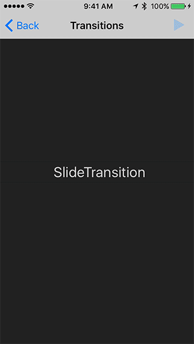

# 2.0.0

This major release of Material Motion focuses includes improvements to the transitioning architecture, the reactive architecture, and new features on many of the interactions.

## Breaking changes

• The `IndefiniteObservable` dependency has been bumped to 4.0.0. [View the release notes](https://github.com/material-motion/indefinite-observable-swift/releases/tag/v4.0.0).

• The `Metadata` and `Inspectable` types have been removed from Material Motion. All related APIs have been simplified accordingly.

• The `MotionRuntime.toGraphViz` API has been removed. There is no replacement API.

• `Tossable`'s `init(system:draggable:)` has been removed. Use `init(spring:draggable:)` instead.

• `SelfDismissingTransition`'s `willPresent(fore:dismisser:)` is no longer a static method. Implement the method as an instance method instead.

• `Transition` is now a class protocol. This means that only object-types can conform to `Transition`.

• `TransitionController`'s `dismisser` has been removed. All methods have been moved directly to the TransitionController object.

• `Tween`'s `keyPositions` has been removed. Use `offsets` instead.

• `MotionRuntime`'s `interactions(for:filter:)` has been removed. Use `interactions(ofType:for:)` instead.

## New features

### Reactive architecture

• Subscriptions no longer automatically unsubscribe when the Subscription object is released. Subscriptions will stay active for as long as the head of the stream is alive.

• Reactive types are now global and shared across all instances of MotionRuntime. You can use `Reactive(object)` to fetch a cached reactive version of a supported type.

• MotionRuntime now supports a `.get` for UISlider instances. This will return an Observable of the slider's value.

• New operator `ignoreUntil`.

• New reactive variant of operator `rubberBanded(outsideOf:maxLength:)`.

• New operator for float types `toString(format:)`.

• New `ReactiveScrollViewDelegate` API turns UIScrollViewDelegate events into observable streams.

For example, the delegate itself is an observable on the scroll view's content offset:

```swift
let delegate = ReactiveScrollViewDelegate()
scrollView.delegate = delegate
delegate.x().subscribeToValue { contentOffset in
  print(contentOffset)
}
```

• New `ReactiveButtonTarget` API for building reactive UIButtons.

• `MotionRuntime` has a new API `start(_:when:is:)` for starting interactions when another interaction reaches a given state.

• `MotionRuntime` has a new `isBeingManipulated` stream. This stream emits true when any `Manipulable` interaction becomes active and false when all `Manipulable` interactions come to rest.

### Interactions

• `MotionRuntime` now has a new `isBeingManipulated` property that indicates whether any manipulation interaction is active.

Any interaction that conforms to the new `Manipulation` type will affect the runtime's `isBeingManipulated` property.

• `Draggable` now has a `resistance` property that can be used to create drag resistance beyond a draggable region.

```swift
draggable.resistance.perimeter.value = someRect
```

• `Tween` has new properties for creating repeating animations: `repeatCount`, `repeatDuration`, and `autoreverses`.

These properties directly map to the corresponding properties in Core Animation.

• `TransitionTween` has new initializer values `delayBefore` and `delayAfter`.

`delayBefore` is the delay used when transitioning forward. `delayAfter` is the delay used when transitioning backward.

• The gesture property for gesture-based interactions is now optional. When nil, the interaction will do nothing.

This is primarily useful when building transitions that have optional interactivity.

### Transitions

• New `TransitionWithFallback` protocol allows transitions to swap themselves out for another transition instance.

• New `TransitionWithPresentation` protocol allows transitions to customize their presentation using an iOS presentation controller. See the modal dialog case study for an example of using this new functionality.

• New `TransitionWithTermination` protocol allows transitions to perform cleanup logic at the end of a transition.

• `TransitionContext`'s `gestureRecognizers` is now settable. This makes it possible to add arbitrary gesture recognizers to a transition.

## Source changes

* [Attempt to reduce the flakiness of the PropertiesNotReleasedWhenDereferenced test.](https://github.com/material-motion/material-motion-swift/commit/e0090c9c0175a1dd2cee7a20edde951faed577bf) (Jeff Verkoeyen)
* [Move fallback calculations to later in the transition lifecycle.](https://github.com/material-motion/material-motion-swift/commit/7ae1b04bbd458c65c7c4d09152c90464ef2fd5bc) (Jeff Verkoeyen)
* [Add a backgroundColor property to Reactive+CALayer.](https://github.com/material-motion/material-motion-swift/commit/9c40e0b8e045312a1c9b256f8fd166a86e70bb2d) (Jeff Verkoeyen)
* [Add a defaultModalPresentationStyle API for transitions with presentation.](https://github.com/material-motion/material-motion-swift/commit/c11949ebad03e306a755325e4f27bfe517485bdf) (Jeff Verkoeyen)
* [Allow TransitionWithPresentation to return nil for conditional presentation.](https://github.com/material-motion/material-motion-swift/commit/5a6570a1e4fe8eef29d3fcffd4d1219fdff47590) (Jeff Verkoeyen)
* [Add support for fallback transitions.](https://github.com/material-motion/material-motion-swift/commit/12acff94e9d0070014c41dd39a7083d57dd4ff5f) (Jeff Verkoeyen)
* [Make TransitionWithPresentation's method an instance method.](https://github.com/material-motion/material-motion-swift/commit/4ad2c55e1cc1f9b5efd50f39195b0d23085b2af4) (Jeff Verkoeyen)
* [Don't attempt to slow down CASpringAnimation animations when slow-motion animations is enabled.](https://github.com/material-motion/material-motion-swift/commit/9d796f374bfb859f5bff1170ca2c1da407373a9d) (Jeff Verkoeyen)
* [Add support for pre/post delay to TransitionTween.](https://github.com/material-motion/material-motion-swift/commit/c0b341672856aa7447f339688bba067e9868679d) (Jeff Verkoeyen)
* [Also slow down the beginTime for tweens when simulator slow motion is enabled.](https://github.com/material-motion/material-motion-swift/commit/fa28ef906310d1ae6794959037d48de98339227b) (Jeff Verkoeyen)
* [When emitting Tweens with a delay, set the fill mode to backward.](https://github.com/material-motion/material-motion-swift/commit/b3908da854352e882b6084a7939e00175d57097b) (Jeff Verkoeyen)
* [Resolve new Xcode 8.3.2 warnings.](https://github.com/material-motion/material-motion-swift/commit/ad99804c4c0c3723e0d3ab7e6ee5a8f7581fee73) (Jeff Verkoeyen)
* [Remove all deprecated APIs in preparation for major release.](https://github.com/material-motion/material-motion-swift/commit/715c97222ab8c73c2432f01033d1a3b12bd616b8) (Jeff Verkoeyen)
* [Remove Metadata.](https://github.com/material-motion/material-motion-swift/commit/fddbc7e888f41e4ac0e10803c365d8116d245b57) (Jeff Verkoeyen)
* [Rename keyPositions to offsets](https://github.com/material-motion/material-motion-swift/commit/8d73d04ff707851e639e11c48f88ec1a363a66e3) (Eric Tang)
* [Add a reactive button target type and an initial isHighlighted stream.](https://github.com/material-motion/material-motion-swift/commit/af75058c6896195a689873eab06613a2adec2798) (Jeff Verkoeyen)
* [Add format support to the toString operator for numerical types.](https://github.com/material-motion/material-motion-swift/commit/6c9d84da86f4d5e614c6e1b9e9cc5baed685a1be) (Jeff Verkoeyen)
* [Add runtime.get for UISlider instances.](https://github.com/material-motion/material-motion-swift/commit/0bcd0f14adcfd4d0f5aa92bfe56647e00372cf2d) (Jeff Verkoeyen)
* [Add reactive UILabel type with text property.](https://github.com/material-motion/material-motion-swift/commit/5bef83680ad50d7b683f7f61e923274e6996ef08) (Jeff Verkoeyen)
* [When using a transition with presentation, use the .custom modal presentation style.](https://github.com/material-motion/material-motion-swift/commit/b0be085ca0a5474e3c27a0ba1bf1029161e28471) (Jeff Verkoeyen)
* [Allow transition types to be instantiated and stored on the transition controller.](https://github.com/material-motion/material-motion-swift/commit/5b6149d5646e3fab1188e8e2c1714d02dc5d0ce8) (Jeff Verkoeyen)
* [Remove the foreAlignmentEdge property from the transition controller.](https://github.com/material-motion/material-motion-swift/commit/235a3e7f3a4b78678b6e841c6e196471436555f4) (Jeff Verkoeyen)
* [Add support for customizing transition presentation.](https://github.com/material-motion/material-motion-swift/commit/d93233e8e433592d6445da9a5bfc382d5f622f44) (Jeff Verkoeyen)
* [Avoid excessive TransitionTween emissions when the transition direction changes.](https://github.com/material-motion/material-motion-swift/commit/33f60d7b260f3c4b9f0c8ad64230bfd68d643e71) (Jeff Verkoeyen)
* [Added ignoreUntil and simplified slop](https://github.com/material-motion/material-motion-swift/commit/86bf12b91ee6d2f1857160a30582221a8a9c4ce7) (Eric Tang)
* [Added unit test](https://github.com/material-motion/material-motion-swift/commit/cb8ba4ff8387d688e47f84cd3e5980ef6ab8d030) (Eric Tang)
* [Swap params for runtime.interactions() API](https://github.com/material-motion/material-motion-swift/commit/7fe07b0f1e3d599aba8727645367df0b553df529) (Eric Tang)
* [Fix build failure.](https://github.com/material-motion/material-motion-swift/commit/98065f2504dec4da267e6f60c7bdd3b7809b3215) (Jeff Verkoeyen)
* [Add a ReactiveScrollViewDelegate and replace usage of the MotionRuntime in the carousel demo.](https://github.com/material-motion/material-motion-swift/commit/db2d5bc8540b282e7dcc72271db62ff3d9565071) (Jeff Verkoeyen)
* [Mark all MotionObservable subscribe methods with @discardableResult.](https://github.com/material-motion/material-motion-swift/commit/ffc8f8c7d3557587721db5e2f1cff0d37ceee0f5) (Jeff Verkoeyen)
* [Add a new Reactive type for querying reactive properties.](https://github.com/material-motion/material-motion-swift/commit/be0ea019c4d2db5ec63e625895f64ec73ca7b702) (Jeff Verkoeyen)
* [Shorten the delayBy test delay.](https://github.com/material-motion/material-motion-swift/commit/67cb7b18dccce117e1a7d248e0919b4f9edb613d) (Jeff Verkoeyen)
* [Added new start function to MotionRuntime](https://github.com/material-motion/material-motion-swift/commit/9c5010e54b8380eae6ce337408aeb1778fc39cc8) (Eric Tang)
* [Reduce flakiness of delay test.](https://github.com/material-motion/material-motion-swift/commit/d584666c449e5a6304a22e8f2fcdcb1d66b6e56a) (Jeff Verkoeyen)
* [Move Timeline to a timeline folder.](https://github.com/material-motion/material-motion-swift/commit/f83c027067fe0ebcc0792d69648362660bcb3279) (Jeff Verkoeyen)
* [Bump IndefiniteObservable to 4.0 and add explicit unsubscriptions to the runtime.](https://github.com/material-motion/material-motion-swift/commit/7adfe179843218713e11001a7839144b0203124f) (Jeff Verkoeyen)
* [Add repeat APIs to Tween](https://github.com/material-motion/material-motion-swift/commit/5022aad2777f16fcb373e2c155e1f0d47ada9a36) (Eric Tang)
* [Change runtime.interactions API to use an ofType: argument instead of a block.](https://github.com/material-motion/material-motion-swift/commit/d6ab9d281ea15f388fe0d099686bb812df3caba8) (Jeff Verkoeyen)
* [Add a resistance property to Draggable.](https://github.com/material-motion/material-motion-swift/commit/dbff13d9018514e67d54742cac1dd4e176ac2b30) (Jeff Verkoeyen)
* [Add a Manipulation type and implement UIKit view controller transitioning interactivity APIs.](https://github.com/material-motion/material-motion-swift/commit/9fa2b22dabc9a7fcd7bfb9a702007db1680d8fd4) (Jeff Verkoeyen)
* [View controllers are only interactive if at least one gesture recognizer is active.](https://github.com/material-motion/material-motion-swift/commit/a921f721ffc5c8b9cc75dc27b589eb949f5c7112) (Jeff Verkoeyen)
* [Ensure that system animations take effect during view controller transitions.](https://github.com/material-motion/material-motion-swift/commit/9b2347005135d11a7c28a5b27af8730c6467724b) (Jeff Verkoeyen)
* [Operators that use _map no longer transform velocity by default.](https://github.com/material-motion/material-motion-swift/commit/dab2e7de73cb8b4485b548b3ca192b9b9484db88) (Jeff Verkoeyen)
* [When no gesture recognizer is provided to a gestural interaction that expects one, the interaction now does nothing.](https://github.com/material-motion/material-motion-swift/commit/d43a5f69cdcf1029273f8873f225845c62a994d1) (Jeff Verkoeyen)
* [Fix build failure.](https://github.com/material-motion/material-motion-swift/commit/3e471897d3b9f2d401ba6d125b480bf1c621405e) (Jeff Verkoeyen)
* [Add foreAlignmentEdge property to TransitionController.](https://github.com/material-motion/material-motion-swift/commit/3498a0f8e7d177e21e89fc2934c371423e79f1f2) (Jeff Verkoeyen)
* [Deprecate transitionController.dismisser and move the APIs into TransitionController.](https://github.com/material-motion/material-motion-swift/commit/e2ad598ae466e4dfe034be751796fd96a82cb37b) (Jeff Verkoeyen)
* [Add missing imports.](https://github.com/material-motion/material-motion-swift/commit/3f16a4d90fc842999fb23b3af7954c69bf6c64a2) (Jeff Verkoeyen)
* [Add missing Foundation import.](https://github.com/material-motion/material-motion-swift/commit/b31c1361ca6744c0c069db98bb6c6b89e3ffbb4b) (Jeff Verkoeyen)
* [Add Togglable conformity to Rotatable and Scalable.](https://github.com/material-motion/material-motion-swift/commit/f90e15b7d62b7f7102e7827a5a850bcbfa7a0451) (Jeff Verkoeyen)

## API changes

Auto-generated by running:

    apidiff origin/stable release-candidate swift MaterialMotion.xcworkspace MaterialMotion

### Debugging

#### Inspectable

*removed* protocol: `Inspectable`

#### Metadata

*removed* class: `Metadata`

### Interactions

#### Draggable

*new* var: `resistance` in `Draggable`

*modified* class: `Draggable`

| Type of change: | Declaration |
|---|---|
| From: | `public final class Draggable : Gesturable<UIPanGestureRecognizer>, Interaction, Togglable, Stateful` |
| To: | `public final class Draggable : Gesturable<UIPanGestureRecognizer>, Interaction, Togglable, Manipulation` |

#### Manipulation

*new* protocol: `Manipulation`

#### Rotatable

*modified* class: `Rotatable`

| Type of change: | Declaration |
|---|---|
| From: | `public final class Rotatable : Gesturable<UIRotationGestureRecognizer>, Interaction, Togglable, Stateful` |
| To: | `public final class Rotatable : Gesturable<UIRotationGestureRecognizer>, Interaction, Togglable, Manipulation` |

#### Scalable

*modified* class: `Scalable`

| Type of change: | Declaration |
|---|---|
| From: | `public final class Scalable : Gesturable<UIPinchGestureRecognizer>, Interaction, Togglable, Stateful` |
| To: | `public final class Scalable : Gesturable<UIPinchGestureRecognizer>, Interaction, Togglable, Manipulation` |

#### Tossable

*removed* method: `init(system:draggable:)` in `Tossable`

#### Tween

*new* var: `offsets` in `Tween`

*new* var: `repeatCount` in `Tween`

*new* var: `repeatDuration` in `Tween`

*new* var: `autoreverses` in `Tween`

*removed* var: `keyPositions` in `Tween`

### Reactive architecture

#### MotionObservableConvertible

*new* method: `ignoreUntil(_:)` in `MotionObservableConvertible`

*new* method: `rubberBanded(outsideOf:maxLength:)` in `MotionObservableConvertible`

*new* method: `toString(format:)` in `MotionObservableConvertible`

#### MotionRuntime

*new* method: `interactions(ofType:for:)` in `MotionRuntime`

*new* method: `start(_:when:is:)` in `MotionRuntime`

*new* var: `isBeingManipulated` in `MotionRuntime`

*removed* method: `interactions(for:filter:)` in `MotionRuntime`

*removed* method: `asGraphviz()` in `MotionRuntime`

#### ReactiveButtonTarget

*new* class: `ReactiveButtonTarget`

*new* var: `didHighlight` in `ReactiveButtonTarget`

#### ReactiveUIView

*removed* class: `ReactiveUIView`

#### ReactiveCAShapeLayer

*removed* class: `ReactiveCAShapeLayer`

#### ReactiveScrollViewDelegate

*new* class: `ReactiveScrollViewDelegate`

### Transitions

#### SelfDismissingTransition

*new* method: `willPresent(fore:dismisser:)` in `SelfDismissingTransition`

*removed* static method: `willPresent(fore:dismisser:)` in `SelfDismissingTransition`

#### Transition

*removed* method: `init()` in `Transition`

*modified* protocol: `Transition`

| Type of change: | Declaration |
|---|---|
| From: | `public protocol Transition` |
| To: | `public protocol Transition : class` |

#### TransitionWithFallback

*new* protocol: `TransitionWithFallback`

*new* method: `fallbackTansition(withContext:)` in `TransitionWithFallback`

#### TransitionWithPresentation

*new* protocol: `TransitionWithPresentation`

*new* method: `presentationController(forPresented:presenting:source:)` in `TransitionWithPresentation`

*new* method: `defaultModalPresentationStyle()` in `TransitionWithPresentation`

#### TransitionWithTermination

*new* protocol: `TransitionWithTermination`

*new* method: `didEndTransition(withContext:runtime:)` in `TransitionWithTermination`

#### TransitionContext

*modified* var: `gestureRecognizers` in `TransitionContext`

| Type of change: | Declaration |
|---|---|
| From: | `public var gestureRecognizers: Set<UIGestureRecognizer> { get }` |
| To: | `public let gestureRecognizers: Set<UIGestureRecognizer>` |

#### TransitionController

*new* method: `disableSimultaneousRecognition(of:)` in `TransitionController`

*new* var: `presentationController` in `TransitionController`

*new* method: `topEdgeDismisserDelegate(for:)` in `TransitionController`

*new* var: `gestureRecognizers` in `TransitionController`

*new* var: `transition` in `TransitionController`

*new* var: `gestureDelegate` in `TransitionController`

*new* method: `dismissWhenGestureRecognizerBegins(_:)` in `TransitionController`

*removed* var: `transitionType` in `TransitionController`

*removed* var: `dismisser` in `TransitionController`

## Non-source changes

* [Update modal dialog example to make use of a presentation controller.](https://github.com/material-motion/material-motion-swift/commit/40decaf295aa1e41417e7f4dec8a7391c29e27ab) (Jeff Verkoeyen)
* [Update CocoaPods to 1.2.1.](https://github.com/material-motion/material-motion-swift/commit/483d52bf017a4c760c83a0d0a6150559d9c5f9e8) (Jeff Verkoeyen)
* [Add Discord badge](https://github.com/material-motion/material-motion-swift/commit/7b5e51f534a206f054b40a9a61a1bdd03a8da957) (Brenton Simpson)
* [Remove use of Reactive type in carousel example.](https://github.com/material-motion/material-motion-swift/commit/27edf6b1f12c2587fa096c22ed9d3d484fc0ca39) (Jeff Verkoeyen)
* [Make both push back case studies use a light status bar in the modal view.](https://github.com/material-motion/material-motion-swift/commit/eaecd862aabb193de5a45024f52365fa1fbcb027) (Jeff Verkoeyen)

# 1.3.0

Highlights:

- First contribution from [Eric Tang](https://github.com/randcode-generator) adding support for `DispatchTimeInterval` initialization of time-based interactions and operators.
- New visualization tools for streams.
- All gestural interactions can now be reactively enabled and disabled.
- Transitions APIs are evolving as we begin work on [components](https://github.com/material-motion/material-motion-components-swift). View the [roadmap](https://material-motion.github.io/material-motion/roadmap/core-team) for more details.

## Behavioral changes

• `defaultTransitionSpringTension` and `defaultTransitionSpringFriction`'s values have been swapped to match the actual default values for tension and friction. These values were previously incorrectly reversed.

• Operators that do not support Core Animation will no longer throw runtime assertions when receiving Core Animation events. We have an [open issue](https://github.com/material-motion/material-motion-swift/issues/41) to explore nicer handling of operators and properties that do not support Core Animation.

## New features

### Runtime

• MotionRuntime now allows you to retrieve interactions associated with a given target with the new `interactions(for:filter:)` API.

Example usage:

```swift
let draggables = runtime.interactions(for: view) { $0 as? Draggable }
```

### Interactions

• `PathTween`, `Tween`, `TransitionTween` each have a new convenience initializer that accepts the `DispatchTimeInterval` enum, making it possible to specify explicit time units. Contributed by [Eric Tang](https://github.com/randcode-generator).

Example usage:

```swift
let tween = Tween<CGFloat>(duration: .milliseconds(300), values: [1, 0])
```

• `Draggable`, `Rotatable`, `Scalable`, and `DirectlyManipulable` now all conform to the `Togglable` type, meaning they can be reactively enabled and disabled.

Example usage:

```swift
draggable.enabled.value = false // Disables the interaction
```

### Operators

• `delay(by:)` now accepts a `DispatchTimeInterval` enum, making it possible to specify explicit time units. Contributed by [Eric Tang](https://github.com/randcode-generator).

```swift
let delayedStream = stream.delay(by: .seconds(1))
```

• `toString()` transforms any stream into a string representation. This is part of our [Reactive Controls milestone](https://github.com/material-motion/material-motion-swift/milestone/2).

```swift
let stringStream = stream.toStream()
```

• `visualize(in:)` allows you to display a stream's values and changes in your app with a new visualization overlay that appears atop your runtime's container view.

Example usage:

```swift
runtime.add(tossable, to: view) { $0.visualize(in: runtime.visualizationView) }
```



## API changes

### Runtime

• MotionRuntime's `add` method now requires that targets conform to AnyObject. This will not affect any of the existing Interactions included with Material Motion. What this change means is that you can no longer build interactions that target non-object types.

### Transitions

• TransitionController is now a pure Swift class type. This means TransitionController is no longer visible to Objective-C code. See https://github.com/material-motion/material-motion-swift/issues/108 for our discussion on Objective-C support.

• `TransitionController` now exposes a `transitioningDelegate` property. `TransitionController` no longer conforms to `UIViewControllerTransitioningDelegate`.

```swift
// Before
viewController.transitioningDelegate = viewController.transitionController

// After
viewController.transitioningDelegate = viewController.transitionController.transitioningDelegate
```

## Source changes

* [Added convenience constructor that takes DispatchTimeInterval for duration (#107)](https://github.com/material-motion/material-motion-swift/commit/ab44321b3906998a72a3a6b544061441179331dd) (Eric Tang)
* [Make ViewControllerDismisser a pure Swift class.](https://github.com/material-motion/material-motion-swift/commit/c0c67c3ffbcc791bf8295b7ddc5ef5c55fe9caa1) (Jeff Verkoeyen)
* [Make TransitionController a pure Swift class.](https://github.com/material-motion/material-motion-swift/commit/d49e2807a43bcb91063f0bd42f77ba820dd3262e) (Jeff Verkoeyen)
* [Add runtime.interactions(for:) API for fetching interactions associated with a given target.](https://github.com/material-motion/material-motion-swift/commit/a34f9942111b9d958efb9c9da01b2722fbf063ec) (Jeff Verkoeyen)
* [Properly compare visualize's label text against the prefixed value string.](https://github.com/material-motion/material-motion-swift/commit/39a23b8866162925f36e5e3059f8ef9d7cd4a1c6) (Jeff Verkoeyen)
* [Add visualize operator and remove runtime.visualize.](https://github.com/material-motion/material-motion-swift/commit/1d0b055bc3de355bbf6fd9e41fb8ea80aa4a56e1) (Jeff Verkoeyen)
* [Make all gestural interactions conform to Togglable.](https://github.com/material-motion/material-motion-swift/commit/e9a0b9b7965c4ba5a0abc8244caa5c73ce125d27) (Jeff Verkoeyen)
* [Use a reasonable fallback when adding visualization views to the runtime container view.](https://github.com/material-motion/material-motion-swift/commit/2e5cf23a5caf67b6ffd6530c7a897c075c695d11) (Jeff Verkoeyen)
* [Add runtime.visualize for visualizing values emitted by streams.](https://github.com/material-motion/material-motion-swift/commit/688644a9a4545bed72cebae66d514a26e71f0cb9) (Jeff Verkoeyen)
* [Remove runtime assertion when core animation events are sent to operators that don't support them.](https://github.com/material-motion/material-motion-swift/commit/b4854cb30e714f88fbfa56b3ef8deeb2174a90fc) (Jeff Verkoeyen)
* [Add toString operator.](https://github.com/material-motion/material-motion-swift/commit/e26425df855d806789c75962d41a0da0a7d84c5e) (Jeff Verkoeyen)
* [Swap the default transition tension/friction values to match the proper variable names.](https://github.com/material-motion/material-motion-swift/commit/11d8ef6bf4b07c8b2902743a41ce8a0cc93f13d1) (Jeff Verkoeyen)

## API changes

Auto-generated by running:

    apidiff origin/stable release-candidate swift MaterialMotion.xcworkspace MaterialMotion

### MotionRuntime

*new* method: `interactions(for:filter:)` in `MotionRuntime`

*modified* method: `add(_:to:constraints:)` in `MotionRuntime`: targets must now conform to AnyObject.

*new* var: `visualizationView` in `MotionRuntime`

### New operators

*new* method: `delay(by:)` in `MotionObservableConvertible`

*new* method: `toString()` in `MotionObservableConvertible`

*new* method: `visualize(_:in:)` in `MotionObservableConvertible`

### Interactions

#### DirectlyManipulable

*modified* class: `DirectlyManipulable`

| Type of change: | Declaration |
|---|---|
| From: | `public final class DirectlyManipulable : NSObject, Interaction, Stateful` |
| To: | `public final class DirectlyManipulable : NSObject, Interaction, Togglable, Stateful` |

#### Draggable

*modified* class: `Draggable`

| Type of change: | Declaration |
|---|---|
| From: | `public final class Draggable : Gesturable<UIPanGestureRecognizer>, Interaction, Stateful` |
| To: | `public final class Draggable : Gesturable<UIPanGestureRecognizer>, Interaction, Togglable, Stateful` |

#### Gesturable

*new* var: `enabled` in `Gesturable`

#### PathTween

*new* method: `init(duration:path:system:timeline:)` in `PathTween`

#### Rotatable

*modified* class: `Rotatable`

| Type of change: | Declaration |
|---|---|
| From: | `public final class Rotatable : Gesturable<UIRotationGestureRecognizer>, Interaction, Stateful` |
| To: | `public final class Rotatable : Gesturable<UIRotationGestureRecognizer>, Interaction, Togglable, Stateful` |

#### Scalable

*modified* class: `Scalable`

| Type of change: | Declaration |
|---|---|
| From: | `public final class Scalable : Gesturable<UIPinchGestureRecognizer>, Interaction, Stateful` |
| To: | `public final class Scalable : Gesturable<UIPinchGestureRecognizer>, Interaction, Togglable, Stateful` |

#### Tween

*new* method: `init(duration:values:system:timeline:)` in `Tween`

#### TransitionTween

*new* method: `init(duration:forwardValues:direction:forwardKeyPositions:system:timeline:)` in `TransitionTween`

### Transitions

#### TransitionController

*modified* class: `TransitionController`

| Type of change: | Declaration |
|---|---|
| From: | `public final class TransitionController : NSObject` |
| To: | `public final class TransitionController` |

*new* var: `transitioningDelegate` in `TransitionController`

#### ViewControllerDismisser

*new* var: `gestureRecognizers` in `ViewControllerDismisser`

# 1.2.1

This is a patch release resolving a crashing bug when `runtime.shouldVisualizeMotion` was enabled and an `ArcMove` interaction was added to a view without a parent.

## Source changes

* [Use a reasonable fallback when adding visualization views to the runtime container view.](https://github.com/material-motion/reactive-motion-swift/commit/efc790a13783f54ff583296a2a7245597c2dbee2) (Jeff Verkoeyen)

# 1.2.0

This minor release introduces a new operator, `startWith`, which is meant to replace the `initialValue` operator.

## New features

### startWith operator

The new `startWith` operator replaces `initialValue` and behaves slightly differently: `startWith` returns a [memory stream](https://github.com/staltz/xstream#memorystream), which is a stream that stores the last value it received and emits it upon subscription. What this means is that the provided initial value will only be emitted once, ever, and that the resulting stream is guaranteed to emit a value on subscription.

You can use startWith to take a stream that may not initially emit values (like a gesture stream) and prime it with an initial value. For example, we use startWith in the "How to use reactive constraints" example in order to ensure that our axis line property is primed with a value.


```swift
let axisCenterX = runtime.get(axisLine.layer).position.x()
runtime.add(Draggable(), to: exampleView) { $0
  .startWith(exampleView.layer.position)
  .xLocked(to: axisCenterX)
}
runtime.add(Draggable(), to: axisLine) { $0.yLocked(to: axisLine.layer.position.y) }
```

## New deprecations

- `initialValue(_:)` has been deprecated in favor of the new `startWith(_:)` operator.

## Source changes

* [Deprecate initialValue and provide startWith as a replacement.](https://github.com/material-motion/material-motion-swift/commit/2a5df59861c4ec0f737e2bc7e38d8bb0801e8e66) (Jeff Verkoeyen)
* [Renamed normalized.swift to normalizedBy.swift.](https://github.com/material-motion/material-motion-swift/commit/8ff079b6ba1322f3fae47a6f2eb2d72bc2158203) (Jeff Verkoeyen)
* [Rename unit test file rewriteTo.swift to rewriteToTests.swift.](https://github.com/material-motion/material-motion-swift/commit/0d81c70185865008282ee717e1bd7404227befe0) (Jeff Verkoeyen)

## API changes

Auto-generated by running:

    apidiff origin/stable release-candidate swift MaterialMotion.xcworkspace MaterialMotion

## MotionObservableConvertible

*new* method: `startWith(_:)` in `MotionObservableConvertible`

*deprecated* method: `initialValue(_:)` in `MotionObservableConvertible`: Use `startWith(_:)` instead.

## Non-source changes

* [Fix README example.](https://github.com/material-motion/material-motion-swift/commit/21ab8263cc0f1bf0b0b7724954b55d9147c480d1) (Jeff Verkoeyen)
* [Fix typo.](https://github.com/material-motion/material-motion-swift/commit/16fbf643a4873c4bc79da83119ed735168070b60) (Jeff Verkoeyen)

# 1.1.0

This is our first minor release. It includes two new interactions and improvements to APIs for the common cases.


## Behavioral changes

- TransitionSpring's configuration now defaults to Core Animation's default values. If you prefer to continue using the original Spring defaults you can use the following snippet:

```swift
spring.tension.value = defaultSpringTension
spring.friction.value = defaultSpringFriction
spring.mass.value = defaultSpringMass
spring.suggestedDuration.value = 0
```

## New deprecations

- Tossable's `init(system:draggable:)` is deprecated in favor of `init(spring:draggable:)`.

## New features

New interactions: `ChangeDirection` and `SlopRegion`.

Gesturable interactions can now be initialized with a sequence of gesture recognizers. This makes it easier to create gesturable interactions in transitions where the gesture recognizers are provided as a set.

Spring's system now defaults to Core Animation.

There is a new API for getting a gesture recognizer delegate that's able to coordinate a "drag to dismiss" transition with a vertical scroll view.

```swift
let pan = UIPanGestureRecognizer()
pan.delegate = transitionController.dismisser.topEdgeDismisserDelegate(for: scrollView)
```

## Source changes

* [Store interactions before adding them so that order is maintained when interactions add other interactions.](https://github.com/material-motion/material-motion-swift/commit/5d0af5fa77b913c0706837d1f0bbf3e14ce9f1ad) (Jeff Verkoeyen)
* [Avoid over-completion of chained property animations.](https://github.com/material-motion/material-motion-swift/commit/51ee058ddc3a15164f4a3c22c522cf3e6fd280c9) (Jeff Verkoeyen)
* [Fix bug causing properties-chained-to-properties to not animate correctly.](https://github.com/material-motion/material-motion-swift/commit/9e810bbf0ddce9764c76ea44dc223ccee4fca0b7) (Jeff Verkoeyen)
* [Add SlopRegion interaction.](https://github.com/material-motion/material-motion-swift/commit/2655adc561181c0679f52df2ca23646abf7876cb) (Jeff Verkoeyen)
* [Add topEdgeDismisserDelegate API to ViewControllerDismisser.](https://github.com/material-motion/material-motion-swift/commit/ad32ba9e7200b59e799d57c0c964b19be55089c3) (Jeff Verkoeyen)
* [Add Gesturable convenience initializer for extracting the first gesture recognizer from a sequence of gesture recognizers.](https://github.com/material-motion/material-motion-swift/commit/c4e0b3d0bf5c2b53e0046c08b63f0592b99b4b46) (Jeff Verkoeyen)
* [Rename ChangeDirectionOnRelease(of:) to ChangeDirection(withVelocityOf:)](https://github.com/material-motion/material-motion-swift/commit/c999a3a5134331e79f3cce74d2be222780155054) (Jeff Verkoeyen)
* [Fix crashing bug when connecting properties to one another.](https://github.com/material-motion/material-motion-swift/commit/840d97cd68321dd241e157ed9527cdc83ed73489) (Jeff Verkoeyen)
* [Add ChangeDirectionOnRelease interaction.](https://github.com/material-motion/material-motion-swift/commit/bdee45533c68f2c98e7b543acf9e3589a783eb46) (Jeff Verkoeyen)
* [Make TransitionSpring and Spring T type conform to Subtractable so that coreAnimation can be set as the default system.](https://github.com/material-motion/material-motion-swift/commit/419327972893b92a4317e903ad933550d096a76f) (Jeff Verkoeyen)
* [TransitionSpring configuration now defaults to Core Animation configuration defaults.](https://github.com/material-motion/material-motion-swift/commit/295d64556048429a5ec6d7859a0ce8922b84a4fd) (Jeff Verkoeyen)

## API changes

Auto-generated by running:

    apidiff origin/stable release-candidate swift MaterialMotion.xcworkspace MaterialMotion

### New global constants

*new* global var: `defaultTransitionSpringFriction`

*new* global var: `defaultTransitionSpringSuggestedDuration`

*new* global var: `defaultTransitionSpringTension`

*new* global var: `defaultTransitionSpringMass`

### New interactions

*new* class: `ChangeDirection`

*new* class: `SlopRegion`

### Modified interactions

#### Gesturable

Affects `Draggable`, `Rotatable`, and `Scalable`.

*new* method: `init(withFirstGestureIn:)` in `Gesturable`

#### Spring

| Type of change: | Declaration |
|---|---|
| From: | `public class Spring<T> : Interaction, Togglable, Stateful where T : Zeroable` |
| To: | `public class Spring<T> : Interaction, Togglable, Stateful where T : Subtractable, T : Zeroable` |

*modified* method: `init(threshold:system:)` in `Spring`

| Type of change: | Declaration |
|---|---|
| From: | `public init(threshold: CGFloat, system: @escaping SpringToStream<T>)` |
| To: | `public init(threshold: CGFloat = 1, system: @escaping SpringToStream<T> = coreAnimation)` |

#### Tossable

*modified* method: `init(spring:draggable:)` in `Tossable`

| Type of change: | Declaration |
|---|---|
| From: | `public init(spring: Spring<CGPoint>, draggable: Draggable = Draggable())` |
| To: | `public init(spring: Spring<CGPoint> = Spring(), draggable: Draggable = Draggable())` |

*deprecated* method: `init(system:draggable:)` in `Tossable`. Use `init(spring:draggable:)` instead.

#### TransitionSpring

*modified* class: `TransitionSpring`

| Type of change: | Declaration |
|---|---|
| From: | `public final class TransitionSpring<T> : Spring<T> where T : Zeroable` |
| To: | `public final class TransitionSpring<T> : Spring<T> where T : Subtractable, T : Zeroable` |

*modified* method: `init(back:fore:direction:threshold:system:)` in `TransitionSpring`

| Type of change: | Declaration |
|---|---|
| From: | `public init(back backwardDestination: T, fore forwardDestination: T, direction: ReactiveProperty<TransitionDirection>, threshold: CGFloat, system: @escaping SpringToStream<T>)` |
| To: | `public init(back backwardDestination: T, fore forwardDestination: T, direction: ReactiveProperty<TransitionDirection>, threshold: CGFloat = default, system: @escaping SpringToStream<T> = default)` |

### Transitions

#### ViewControllerDismisser

*new* method: `topEdgeDismisserDelegate(for:)` in `ViewControllerDismisser`

### Stream changes

*new* var: `onCompletion` in `CoreAnimationChannelAdd`

*removed* var: `onCompletion` in `CoreAnimationChannelAdd`

## Non-source changes

* [Modify the PushBackTransition example to use connected properties instead of multiple springs.](https://github.com/material-motion/material-motion-swift/commit/71f06c23ec9ef8f460ad48de6f6af540f1eec4c9) (Jeff Verkoeyen)
* [Simplify the interactive push back transition example.](https://github.com/material-motion/material-motion-swift/commit/b8620649aae2eadf93ec66c82b164759a067931d) (Jeff Verkoeyen)
* [Add syntax highlighting languages to the README.](https://github.com/material-motion/material-motion-swift/commit/486cff7dc497a66c5479f8117a599cf778fa575a) (Jeff Verkoeyen)
* [Add example Podfile to the README.](https://github.com/material-motion/material-motion-swift/commit/687e6cc01dc82bd114a5f4f913cee54dc5071806) (Jeff Verkoeyen)

# 1.0.0

Initial stable release of Material Motion. Includes:

- Interactions with constraint support.
- Runtime visualization using graphviz.
- Many case studies in the Catalog app.
- A Swift playground.

## Source changes

* [Reintroduce property core animation event forwarding.](https://github.com/material-motion/material-motion-swift/commit/769eda28999654ebe674eddd337e7a7eefddcd13) (Jeff Verkoeyen)
* [And one last missing import.](https://github.com/material-motion/material-motion-swift/commit/b930d6f6b09acd926bbe807c535007e55df2aaf0) (Jeff Verkoeyen)
* [Add one more missing import.](https://github.com/material-motion/material-motion-swift/commit/e07e417e151770d2eb6dd40a9f476c441f085a06) (Jeff Verkoeyen)
* [Add more missing UIKit imports.](https://github.com/material-motion/material-motion-swift/commit/41513ac58461befa33d6e717d0afa4297b82a928) (Jeff Verkoeyen)
* [Add missing import statements throughout the codebase.](https://github.com/material-motion/material-motion-swift/commit/a1df6abb9a6ab135f1da6323b1078dba788497eb) (Jeff Verkoeyen)
* [Slow down Core Animation animations when simulator slow motion animations is enabled.](https://github.com/material-motion/material-motion-swift/commit/6b12e122556744ddd917791da491e872d9f6f888) (Jeff Verkoeyen)
* [Add default coordinate space to SetPositionOnTap initializer.](https://github.com/material-motion/material-motion-swift/commit/a50e1fb2d1a62c0c9f65b574cfe15449f496986e) (Jeff Verkoeyen)
* [Rename TransitionContext.Direction to TransitionDirection.](https://github.com/material-motion/material-motion-swift/commit/be309dfd50e4242d567be60a5aa5c0ce0829513d) (Jeff Verkoeyen)
* [Add x-/yLockedTo tests.](https://github.com/material-motion/material-motion-swift/commit/2320d02040877672ac2b35600fa4b73c2eb23499) (Jeff Verkoeyen)
* [Use a different y value for normalize tests.](https://github.com/material-motion/material-motion-swift/commit/3175c40ebb03225e423ef920c59a58730e6654ba) (Jeff Verkoeyen)
* [Rename threshold event to threshold side and drop the -when prefix.](https://github.com/material-motion/material-motion-swift/commit/26a630ffc82165b9eb8270d4460cae13ba4549bf) (Jeff Verkoeyen)
* [Add threshold tests.](https://github.com/material-motion/material-motion-swift/commit/1f6ad1dda2c9c821d6def27787ed532cea75b940) (Jeff Verkoeyen)
* [Add rubberBanded tests.](https://github.com/material-motion/material-motion-swift/commit/eabff9aaa32a0e3802fbb3ec409b4c15ca9e8363) (Jeff Verkoeyen)
* [Remove subtractedFrom operator.](https://github.com/material-motion/material-motion-swift/commit/76efa7a5fd13fc554f0ef79968d42ba3f63af8c1) (Jeff Verkoeyen)
* [Add offsetBy and scaledBy tests.](https://github.com/material-motion/material-motion-swift/commit/a943dca204844ddfde2b757250e0fee31e60a94c) (Jeff Verkoeyen)
* [Add normalize tests.](https://github.com/material-motion/material-motion-swift/commit/3317f9ce2ed3e298cec29b65e7fe0b5e6c856e9d) (Jeff Verkoeyen)
* [Add anchorPointAdjustment tests.](https://github.com/material-motion/material-motion-swift/commit/2a52779f41790c35f6efd0d950dbc964153122a7) (Jeff Verkoeyen)
* [Fix bug causing Tween never to come to rest.](https://github.com/material-motion/material-motion-swift/commit/1150faf4bb39f1f74e52147973b90ffb04469f24) (Jeff Verkoeyen)
* [Add rewrite tests.](https://github.com/material-motion/material-motion-swift/commit/d825afffae9ad8bb606e183c44e52dd85a1b1d3a) (Jeff Verkoeyen)
* [Add merge tests.](https://github.com/material-motion/material-motion-swift/commit/9d4a2c498127df4fe4123fa82a8348366906f96c) (Jeff Verkoeyen)
* [Add inverted tests.](https://github.com/material-motion/material-motion-swift/commit/3816f754a75fe27dbb8420763641b7f79cd07f05) (Jeff Verkoeyen)
* [Add distanceFrom tests and improve reactive implementation.](https://github.com/material-motion/material-motion-swift/commit/da2bc9877cd0318722acb2fdbb1a28c513835b79) (Jeff Verkoeyen)
* [Add initialValue tests.](https://github.com/material-motion/material-motion-swift/commit/54cd68ad7a959dcc0e00ff97b700d56cb81587da) (Jeff Verkoeyen)
* [Remove unnecessary testing imports.](https://github.com/material-motion/material-motion-swift/commit/e3407ba7e41a4a653e98a28077a6f72b306e4e6e) (Jeff Verkoeyen)
* [Add valve tests.](https://github.com/material-motion/material-motion-swift/commit/24b091090f7f6f85dfe45f72cf62bcf96628faa7) (Jeff Verkoeyen)
* [Add upper-/lowerBound tests.](https://github.com/material-motion/material-motion-swift/commit/2a9bb9864372514f32eb3cb7b0160cd0326a1b57) (Jeff Verkoeyen)
* [Add delay tests.](https://github.com/material-motion/material-motion-swift/commit/8807df30afd2f08fd8a49d4b5a71738966e42fb4) (Jeff Verkoeyen)
* [Add dedupe tests.](https://github.com/material-motion/material-motion-swift/commit/1851500d90859aae856bf56f944f0a22541d593c) (Jeff Verkoeyen)
* [Add slop tests.](https://github.com/material-motion/material-motion-swift/commit/073cff16e864766701aac9bc7d4252a626638875) (Jeff Verkoeyen)
* [Default untyped integer literals to be CGFloat ReactiveProperties.](https://github.com/material-motion/material-motion-swift/commit/1b1402e677355dddfac4a11fdd6d74e09018b984) (Jeff Verkoeyen)
* [Rearrange the operator unit tests to match the source file layout.](https://github.com/material-motion/material-motion-swift/commit/ca5c3a403a655db379ba29573a3f79e813607c9a) (Jeff Verkoeyen)
* [Add Addable/Subtractable tests.](https://github.com/material-motion/material-motion-swift/commit/f91a445834f44f95b525c540e85c7494433f1a05) (Jeff Verkoeyen)
* [Add _remember tests.](https://github.com/material-motion/material-motion-swift/commit/2b647ad1358a89bc7a6f0cd84bd583a639246786) (Jeff Verkoeyen)
* [Add Core Animation _map tests.](https://github.com/material-motion/material-motion-swift/commit/dbb572881e0e2a706514e4f7da3822d6d33f533e) (Jeff Verkoeyen)
* [Add TransitionTween interaction.](https://github.com/material-motion/material-motion-swift/commit/bea6e0ee8d197036f5e81d79ce621892b786b3fa) (Jeff Verkoeyen)
* [Add support for reactively re-animating Tweens when values or keyPositions changes.](https://github.com/material-motion/material-motion-swift/commit/c3c95c2a26037e457161e481ea125c35b5502699) (Jeff Verkoeyen)
* [Make TransitionContext.Direction conform to Invertible.](https://github.com/material-motion/material-motion-swift/commit/0f837eda135af0bb04b531db99f03101d3563eb3) (Jeff Verkoeyen)
* [Add rewrite operator that accepts an observable.](https://github.com/material-motion/material-motion-swift/commit/53febcd8e1d12ec557b4fa257dff2646127d0345) (Jeff Verkoeyen)
* [Add Invertible type and general-purpose inverted operator.](https://github.com/material-motion/material-motion-swift/commit/aa78d11975025f1ab38cfa209e594341d2087d37) (Jeff Verkoeyen)
* [Add support for additive Core Animation tweens.](https://github.com/material-motion/material-motion-swift/commit/3579db6ece0af81518757498c8d2a4ffa1aee1f1) (Jeff Verkoeyen)
* [Make additive calculations more generic in preparation for keyframe additive animation support.](https://github.com/material-motion/material-motion-swift/commit/5949462ad84842874400c76a5ad49f295be07a1c) (Jeff Verkoeyen)
* [Ensure that Gesturable interactions that use an existing gesture recognizer prime the initial state.](https://github.com/material-motion/material-motion-swift/commit/d24723ffb60b1b2e75e71fa56c8a343234e1c758) (Jeff Verkoeyen)
* [Remove superfluous Equatable conformity in coreAnimationSpringToStream.](https://github.com/material-motion/material-motion-swift/commit/b0b84ffe236c56f48a90ae7086d4071092b34fcb) (Jeff Verkoeyen)
* [Add width/height reactive properties to CALayer.](https://github.com/material-motion/material-motion-swift/commit/da7f38d6c09c58af4c9bc16792f2a1f2b27f3065) (Jeff Verkoeyen)
* [Make all classes final that can be.](https://github.com/material-motion/material-motion-swift/commit/89b8ce23f274ea700f272aac90bed71a0ed91e9d) (Jeff Verkoeyen)
* [Add NoConstraints typealias for interactions that don't support constraints.](https://github.com/material-motion/material-motion-swift/commit/fbccbe237118f0a99c600137a72e72ee9194d791) (Jeff Verkoeyen)
* [Add draggable.finalVelocity API.](https://github.com/material-motion/material-motion-swift/commit/ad6497027db987d41fdcf6757de095c4683ee63b) (Jeff Verkoeyen)
* [Rename runtime.disable to runtime.toggle.](https://github.com/material-motion/material-motion-swift/commit/0bf4c14fc5059db91503649fdd6d609469db333c) (Jeff Verkoeyen)
* [Use primary/secondary colors for metadata readouts.](https://github.com/material-motion/material-motion-swift/commit/855b5965cf0890dbbaa00223a7ff9e7f4262fac4) (Jeff Verkoeyen)
* [Simulate atRest/active eventing for tap gestures so that they can be used to start animations.](https://github.com/material-motion/material-motion-swift/commit/5efbe8a3074796bd9b3316e0d37e6e1ea116b8db) (Jeff Verkoeyen)
* [Resolve Xcode 8.3 warnings.](https://github.com/material-motion/material-motion-swift/commit/36bda03fa703b9abc290baa12dc7b523c22b237c) (Jeff Verkoeyen)
* [Add Tween example and hacky runtime.start(when) mechanism.](https://github.com/material-motion/material-motion-swift/commit/f8798a70954b9f0f693b0442cb6deb3527cb71cd) (Jeff Verkoeyen)
* [Add Scalable/Tossable interaction demos and fix bug in Tossable state reporting.](https://github.com/material-motion/material-motion-swift/commit/d1023acbbb5f363d4ce5db8d329247c7b7102913) (Jeff Verkoeyen)
* [Update name to MaterialMotion.](https://github.com/material-motion/material-motion-swift/commit/1131a511bb75bef7e4a7348124f17675c4013b52) (Jeff Verkoeyen)
* [Provide a default for ArcMove's initializer.](https://github.com/material-motion/material-motion-swift/commit/b39fbc9472767e20573512d964d9d32b7634f2a6) (Jeff Verkoeyen)
* [Add rotatable example and make Rotatable/Scalable conform to Stateful.](https://github.com/material-motion/material-motion-swift/commit/cca2a923df75fc3e1729b322fb332aa27e9b047a) (Jeff Verkoeyen)
* [Remove old demos and general usage of POP in preparation for moving POP to an external dependency.](https://github.com/material-motion/material-motion-swift/commit/1a52bf9cba957705471398bf27e6e61cfa877643) (Jeff Verkoeyen)
* [Make coreAnimation the default system for all tweens and tossable.](https://github.com/material-motion/material-motion-swift/commit/63718acd844cdef3c5be7f459033f9ea32131efd) (Jeff Verkoeyen)
* [Add AggregateMotionState for treating many MotionState streams as a single stream.](https://github.com/material-motion/material-motion-swift/commit/5ee800c2c547487c5df4348755f51b161fbd320e) (Jeff Verkoeyen)
* [Bump supported SDK to iOS 9.](https://github.com/material-motion/material-motion-swift/commit/6516319399ca43751f28f3f42e1dd2a9e29f1394) (Jeff Verkoeyen)
* [Pull the core animation reactive property builder out of ReactiveCALayer so that apps can create custom core animation properties.](https://github.com/material-motion/material-motion-swift/commit/ffd9b25b0ca6769e6b9e79b923b38354e7fcad11) (Jeff Verkoeyen)
* [Fix bug with runtime.get and gesture recognizer typing.](https://github.com/material-motion/material-motion-swift/commit/b352d1780ffcf7c78fdfa3860169ad1fbbfd222c) (Jeff Verkoeyen)
* [Remove reactive UIView center properties.](https://github.com/material-motion/material-motion-swift/commit/0d3d9080b866ade84cea0ec97d14f2307a2ec6f1) (Jeff Verkoeyen)
* [Documentation pass at all operators.](https://github.com/material-motion/material-motion-swift/commit/798f2c6eaabe952febd016bef6edec779af8c3a0) (Jeff Verkoeyen)
* [Document TransitionSpring.](https://github.com/material-motion/material-motion-swift/commit/590543db23669a7172544f74e19c07682637c95a) (Jeff Verkoeyen)
* [Document the Tossable interaction.](https://github.com/material-motion/material-motion-swift/commit/c7a22031117bc5d1e471c7df8dbbba1a2d22dcd4) (Jeff Verkoeyen)
* [Document the PathTween interaction.](https://github.com/material-motion/material-motion-swift/commit/e8051f1b6ccb3cd04968616c356908b398b4a12c) (Jeff Verkoeyen)
* [Move Interaction conformity to the type definition.](https://github.com/material-motion/material-motion-swift/commit/2d8bce3f8027c3dfc790bdce22aa278883af405c) (Jeff Verkoeyen)
* [Flesh out docs for ArcMove and AdjustsAnchorPoint.](https://github.com/material-motion/material-motion-swift/commit/647fc29df96880b947e6be2b5d77d0ecbf6c15f2) (Jeff Verkoeyen)
* [Adjust MotionObservable subscription APIs to encourage forwarding channels rather than creating a terminal subscription.](https://github.com/material-motion/material-motion-swift/commit/2f85d88dda051fcce2642c078bde268d90931395) (Jeff Verkoeyen)
* [Rename translated to translation(addedTo:).](https://github.com/material-motion/material-motion-swift/commit/36905106440def6eefde9c253ae19126244f2e42) (Jeff Verkoeyen)
* [Rename onRecognitionState to whenRecognitionState.](https://github.com/material-motion/material-motion-swift/commit/9e18efbb413cdacc9dfad863602891e0e74ff3b2) (Jeff Verkoeyen)
* [Change the reactive object cache to use ObjectIdentifier as the key and consolidate the caches to one dictionary.](https://github.com/material-motion/material-motion-swift/commit/127a8626895ce5526900baeeb6f3d6c42440a9cb) (Jeff Verkoeyen)
* [Fix minor typo in documentation.](https://github.com/material-motion/material-motion-swift/commit/71b732c71a5eb0510ceac15e774d3e00b583390b) (Jeff Verkoeyen)
* [Rename Tap to SetPositionOnTap and document the class.](https://github.com/material-motion/material-motion-swift/commit/c395f309bbdd32e9da960f3ba36b9b8440390f51) (Jeff Verkoeyen)
* [Document the Spring interaction.](https://github.com/material-motion/material-motion-swift/commit/189538933230edf08734a3c608019e59926bb3d7) (Jeff Verkoeyen)
* [Support generic T value types for POP springs.](https://github.com/material-motion/material-motion-swift/commit/affb106377f1b899a7af9b600f9bc31896a10230) (Jeff Verkoeyen)
* [Clean up the Tween documentation.](https://github.com/material-motion/material-motion-swift/commit/cf4d77582204af6df8336e6984a17880df115c2a) (Jeff Verkoeyen)
* [Make all gestural interaction classes final.](https://github.com/material-motion/material-motion-swift/commit/f5445ea3de51dbe208dbd4eb4e3e29628aa47cbc) (Jeff Verkoeyen)
* [Document Draggable, Rotatable, and Scalable.](https://github.com/material-motion/material-motion-swift/commit/4b323f3bae5c112a537fdb597e88bbd708d0c204) (Jeff Verkoeyen)
* [Flesh out the DirectlyManipulable docs.](https://github.com/material-motion/material-motion-swift/commit/a87fe5fff018be0a836b9f432aec424e6c4eda6a) (Jeff Verkoeyen)
* [Move Metadata deeper into the operator implementations.](https://github.com/material-motion/material-motion-swift/commit/06f881fb38557367710ed0256780c11495100cc3) (Jeff Verkoeyen)
* [Minor modernization of ReactiveProperty method signature.](https://github.com/material-motion/material-motion-swift/commit/a36db703a833f9c9f82f32fa0d250148d84b54e1) (Jeff Verkoeyen)
* [Reduce the public API footprint of Metadata.](https://github.com/material-motion/material-motion-swift/commit/13cd8bd9f6b9316a8dd5e844fb126a83a0c9e5a3) (Jeff Verkoeyen)
* [Move MotionState to Stateful.swift.](https://github.com/material-motion/material-motion-swift/commit/fe0a3e9c9b16ccaf6cf9bffd3c8e87b4268ba993) (Jeff Verkoeyen)
* [Document and clean up the MotionRuntime APIs.](https://github.com/material-motion/material-motion-swift/commit/05ca5142b02daa6cae037cbac1e61a1d30eb6b29) (Jeff Verkoeyen)
* [Add constraint support to spring/tossable.](https://github.com/material-motion/material-motion-swift/commit/9cf244054469703f75c0bf439b573e0346034c86) (Jeff Verkoeyen)
* [Minor docs cleanup of Interaction.](https://github.com/material-motion/material-motion-swift/commit/3d17179490594acca4a97adbe9ddd3685e40cec2) (Jeff Verkoeyen)
* [Rename the library to ReactiveMotion.](https://github.com/material-motion/material-motion-swift/commit/49af8d68c942359440475918573242c3a33bb9b6) (Jeff Verkoeyen)
* [Move all examples to the Catalog target and resolve all API visibility failures.](https://github.com/material-motion/material-motion-swift/commit/3aad67072a6a051e0a0bcfed3bf38884a4c9b221) (Jeff Verkoeyen)
* [Move files into subfolders to clean up the root folder's classes.](https://github.com/material-motion/material-motion-swift/commit/123ad5fde6a15aaa683ea7904f7a1cbb2285a465) (Jeff Verkoeyen)
* [Document and simplify the Interaction types.](https://github.com/material-motion/material-motion-swift/commit/3c1e451cd0ec7186871aad93bc4954e2f7e98762) (Jeff Verkoeyen)
* [Add constraint support to Tween.](https://github.com/material-motion/material-motion-swift/commit/52a225bac2c27c2fe1aaf1085b4941819000600d) (Jeff Verkoeyen)
* [Add constraint support to additive animations.](https://github.com/material-motion/material-motion-swift/commit/fc6ab16fe8da5be55f1536b3cee53db426e24238) (Jeff Verkoeyen)
* [Add constraint support to Rotatable/Scalable.](https://github.com/material-motion/material-motion-swift/commit/718784ad2cbcb78c42ebaac585f3492b9b44e417) (Jeff Verkoeyen)
* [Introduce interaction constraints.](https://github.com/material-motion/material-motion-swift/commit/b50e6e00bb122b8db6bf778b49cd11636453bcd5) (Jeff Verkoeyen)
* [Flatten the Interaction types down to a single Interaction protocol.](https://github.com/material-motion/material-motion-swift/commit/53352b910fca7f098ab4a015d526889eaa67bc75) (Jeff Verkoeyen)
* [100% coverage of ReactiveProperty.](https://github.com/material-motion/material-motion-swift/commit/9c346d4b60fcd300d2c2e94b46cc3bc544bafa93) (Jeff Verkoeyen)
* [Implement a reactive variant of xLockedTo.](https://github.com/material-motion/material-motion-swift/commit/1db30cec8ef29a2a0f5f02de4ba85fcffe28ec2c) (Jeff Verkoeyen)
* [Add initialValue operator.](https://github.com/material-motion/material-motion-swift/commit/3792707a5530344fbae667d51f3d95d0eb5d2a8b) (Jeff Verkoeyen)
* [100% coverage of MotionObservable.](https://github.com/material-motion/material-motion-swift/commit/cfa1c50eea5732266032ae22b56c97fe8693deb0) (Jeff Verkoeyen)
* [Move TimelineView to the examples supplemental directory rather than src.](https://github.com/material-motion/material-motion-swift/commit/881d635dd9006af6f48e1c241afb71fb3eb4adea) (Jeff Verkoeyen)
* [Remove ReactivePropertyConvertible.](https://github.com/material-motion/material-motion-swift/commit/e4f4f8b5836d7fad59b24cccba9259d9fc251964) (Jeff Verkoeyen)
* [Simplify the runtime.connect generic signatures.](https://github.com/material-motion/material-motion-swift/commit/ed29bb05d49b79add2f29cf62a594d978ee6dbaa) (Jeff Verkoeyen)
* [Add x/yLockedTo constraints.](https://github.com/material-motion/material-motion-swift/commit/d9468556e4ec182d9b2275e085b0600889238beb) (Jeff Verkoeyen)
* [Remove literal convertibles.](https://github.com/material-motion/material-motion-swift/commit/1a4694bea5cdb768a2ff397890485f376b4d957b) (Jeff Verkoeyen)
* [Introduce runtime.connect.](https://github.com/material-motion/material-motion-swift/commit/f865c56d46da08a98c14eb9ba2b91fc67e54b597) (Jeff Verkoeyen)
* [Fix bug with Tossable being used with TransitionSpring instances.](https://github.com/material-motion/material-motion-swift/commit/167b21b2d7eb97a4f3a3e0f94011efc2ac22a8d8) (Jeff Verkoeyen)
* [Remove Core Animation forwarding from ReactiveProperty.](https://github.com/material-motion/material-motion-swift/commit/cb5e34a92f20b5f0c2b3cdbfcaf1d18ec653a5b0) (Jeff Verkoeyen)
* [Remove the Tossable Destination type.](https://github.com/material-motion/material-motion-swift/commit/8bcc5520e17adc888a377fbe6a3030dd46e74c5a) (Jeff Verkoeyen)
* [Remove TransitionInteraction type.](https://github.com/material-motion/material-motion-swift/commit/7b0af6e360e4b29f8ce8256ebd8161223340838e) (Jeff Verkoeyen)
* [Make use of StatefulInteraction type for transition completion.](https://github.com/material-motion/material-motion-swift/commit/c4e805154f46107780ea21752fd3110e86a98440) (Jeff Verkoeyen)
* [Introduce Togglable- and StatefulInteraction types and runtime.enable that makes use of them.](https://github.com/material-motion/material-motion-swift/commit/49f7509505aacaba2d320ecdf0204be1dd3f2460) (Jeff Verkoeyen)
* [Remove asStream conversions.](https://github.com/material-motion/material-motion-swift/commit/3b26f8aac0109038d382c94b87db0f91c9e94b21) (Jeff Verkoeyen)
* [Request that Transition instances return the list of streams that define completion.](https://github.com/material-motion/material-motion-swift/commit/5d816d3d031bcc7d2e67390fb15da992a2b8b9b7) (Jeff Verkoeyen)
* [Move most interaction protocol implementations to extensions.](https://github.com/material-motion/material-motion-swift/commit/13753c886f6b2a3ad7c4888789498603b8d60b32) (Jeff Verkoeyen)
* [Make coordinate space an explicit argument on the Tap interaction.](https://github.com/material-motion/material-motion-swift/commit/0fa6e11f782d6deacbbc42726d86f9c4743b4abe) (Jeff Verkoeyen)
* [Rework the gestural interactions to use constant properties where applicable.](https://github.com/material-motion/material-motion-swift/commit/4b61868298e5c73283a3616f424832dc3e24497b) (Jeff Verkoeyen)
* [Remove excessive .asStream invocations by adding a property-to-property runtime.add method.](https://github.com/material-motion/material-motion-swift/commit/00af84abf9be2a588f24c94bb805bba6e05fdc02) (Jeff Verkoeyen)
* [Move timeline channel event into the .add event and ensure that visualization views are remembered by the _remember operator.](https://github.com/material-motion/material-motion-swift/commit/e3a3a62a3e090d65eb760553b73a99a799f8abd4) (Jeff Verkoeyen)
* [Resolve memory leak in Spring implementation.](https://github.com/material-motion/material-motion-swift/commit/d44edc13bd1fcaeb6b74cf8c841138a1ebe7499f) (Jeff Verkoeyen)
* [Make Tween's system property a private const.](https://github.com/material-motion/material-motion-swift/commit/81356affbedb106600c545cd47a09ef346d66071) (Jeff Verkoeyen)
* [Make timeline a constant on Tween.](https://github.com/material-motion/material-motion-swift/commit/1ceaa60a840c79577415a0983d9808ea7adb6334) (Jeff Verkoeyen)
* [Make all non-reactive ArcMove properties constant.](https://github.com/material-motion/material-motion-swift/commit/c0858dbc76c59d2d59e2414e1e057360eae39bed) (Jeff Verkoeyen)
* [Make all non-reactive properties on AdjustsAnchorPoint constant.](https://github.com/material-motion/material-motion-swift/commit/07ee3c33aeb058b0d034fc6a8a9d2686852b0390) (Jeff Verkoeyen)
* [Creates a TimelineView in /supplemental](https://github.com/material-motion/material-motion-swift/commit/4daf8803c3b1070ed66883db01706b9864daeb47) (Andres Ugarte)
* [Only keep one animation at a time](https://github.com/material-motion/material-motion-swift/commit/5cf073c274e92bfe7bebfc90cc4f3319c6a9599e) (Andres Ugarte)
* [Improve support for Springs being added to many targets.](https://github.com/material-motion/material-motion-swift/commit/a83acb0e03438080c4adcfa0787de41bdb2893c2) (Jeff Verkoeyen)
* [Resolve warnings detected by Xcode 8.3.](https://github.com/material-motion/material-motion-swift/commit/253c94c1f48fa7960d8cb8dde58e8d6b8ba5244d) (Jeff Verkoeyen)
* [Fix previous commit affecting implicit animations on CALayer.](https://github.com/material-motion/material-motion-swift/commit/a7bbbbb3b4c9d30d9f724809e60bfcfd5539761e) (Jeff Verkoeyen)
* [Disable actions when writing to CALayer properties.](https://github.com/material-motion/material-motion-swift/commit/a8c9ed584c327a9e07ba0b7cbf777753fb580ff0) (Jeff Verkoeyen)
* [Fix recursive call to .zero()](https://github.com/material-motion/material-motion-swift/commit/d4580174fa9e4bc97641c5a4efcbf568653dc3e7) (Andres Ugarte)
* [Debug layer for paths and tweaks to the Arc example](https://github.com/material-motion/material-motion-swift/commit/40301146aa20f128fc000acf5f2c07ec007d5b0c) (Andres Ugarte)
* [Make all Tween properties be reactive properties and use shadow pattern to avoid retain cycles in system implementation.](https://github.com/material-motion/material-motion-swift/commit/a9eb7b19782633226f3fe3172011037249b46461) (Jeff Verkoeyen)
* [Consolidate arc move logic into the interaction file.](https://github.com/material-motion/material-motion-swift/commit/ccc259afabcf361c694a80652147c41f5514a21b) (Jeff Verkoeyen)
* [Rename mapRange to rewriteRange.](https://github.com/material-motion/material-motion-swift/commit/058a99a1d6e421ae4f6356c0869d01be44a934ea) (Jeff Verkoeyen)
* [Rename mapTo to rewriteTo.](https://github.com/material-motion/material-motion-swift/commit/14305db3ff7f6eb2c2006d1894af30f499e710d2) (Jeff Verkoeyen)
* [Add fab transition demo.](https://github.com/material-motion/material-motion-swift/commit/f8eae371c32803d3660ee769375af09c24e3e875) (Jeff Verkoeyen)
* [Moving all source to follow the new systems naming convention.](https://github.com/material-motion/material-motion-swift/commit/4b09fe6f7a9f37e2e19dbce3da812b27d52fa3d3) (Jeff Verkoeyen)
* [Remove the term director from the code base.](https://github.com/material-motion/material-motion-swift/commit/a5557cc411d5abf8d995a83aaef810e91bb3d57f) (Jeff Verkoeyen)
* [Store the last-seen initial value for translated, rotated, and scaled.](https://github.com/material-motion/material-motion-swift/commit/7cefc367425dc88bcfb7b066a4ec11eb71020da5) (Jeff Verkoeyen)
* [Remove destinations operator in favor of rewrite.](https://github.com/material-motion/material-motion-swift/commit/db54143d98e161425bd27058c5b19111c1c3a94f) (Jeff Verkoeyen)
* [Rename rubberBand.swift to rubberBanded.swift.](https://github.com/material-motion/material-motion-swift/commit/9d1164d18dd291a262f7c51ee25a62469e0c10b2) (Jeff Verkoeyen)
* [Threshold and slop now both emit simple events which must be rewritten to more complex types.](https://github.com/material-motion/material-motion-swift/commit/69fd57bb3d06811572ee308aee83b3a78ce713ae) (Jeff Verkoeyen)
* [Split threshold into threshold and thresholdRange.](https://github.com/material-motion/material-motion-swift/commit/94ec568b14fb50e339ed499b6b4dc79a23738532) (Jeff Verkoeyen)
* [Rename read to _read and move it to foundation.](https://github.com/material-motion/material-motion-swift/commit/ffa3c96845de22f1039f0ac0d188da9a6b0f6829) (Jeff Verkoeyen)
* [Touch up valve implementation.](https://github.com/material-motion/material-motion-swift/commit/c08a04773b3027f8bafd5e81c9ceb461ddfac230) (Jeff Verkoeyen)
* [Clean up and rename arguments for mapRange.](https://github.com/material-motion/material-motion-swift/commit/846d732e619ee38c2150f7021d980bbd038e9244) (Jeff Verkoeyen)
* [Add docs to inverted.](https://github.com/material-motion/material-motion-swift/commit/c5e63da5c11f651616d616e2c7774d1b4a282716) (Jeff Verkoeyen)
* [Rename distance file to distanceFrom.](https://github.com/material-motion/material-motion-swift/commit/c12bb3ea6bc1d0773d9da6624a481ac8d4cd1104) (Jeff Verkoeyen)
* [Add dedupe docs.](https://github.com/material-motion/material-motion-swift/commit/69aafaed6c72cad33736d184e553b88443b8ffde) (Jeff Verkoeyen)
* [Rename anchored to anchorPointAdjustment and touch up the docs.](https://github.com/material-motion/material-motion-swift/commit/6247e57bfa4a299773b45c12e4e08457fd74786e) (Jeff Verkoeyen)
* [Move x and y operators to their own files.](https://github.com/material-motion/material-motion-swift/commit/2b529178760126987452596a89b8f0ac9b627917) (Jeff Verkoeyen)
* [Move offset, scaled, and subtracted out to their own files.](https://github.com/material-motion/material-motion-swift/commit/1c594bfd24df227fcf94872ca14ada665fc7a52a) (Jeff Verkoeyen)
* [Move normalized operators out to their own file.](https://github.com/material-motion/material-motion-swift/commit/29304b22678da829181bca8ff6f719c124c81bf0) (Jeff Verkoeyen)
* [Rename _memoize to _remember.](https://github.com/material-motion/material-motion-swift/commit/c46620427adaa11b48cf40e3462f9d659c82f8e3) (Jeff Verkoeyen)
* [Remove unnecessary block from _memoize implementation.](https://github.com/material-motion/material-motion-swift/commit/1574422dbf826784fc3d8f52e784ce745e04cd35) (Jeff Verkoeyen)
* [Remove dead code in _memoize.](https://github.com/material-motion/material-motion-swift/commit/b1ec709db6a523a963446c5178ea1abedb734404) (Jeff Verkoeyen)
* [Rename min/max to lowerBound/upperBound, respectively.](https://github.com/material-motion/material-motion-swift/commit/6bbbf046c3151353d129008bca2c0d2710f9eb31) (Jeff Verkoeyen)
* [Move min and max out to their own files.](https://github.com/material-motion/material-motion-swift/commit/6b6879050c4280aa35e5286bff70eacf0164181c) (Jeff Verkoeyen)
* [Remove excessive asStream cast from operators.](https://github.com/material-motion/material-motion-swift/commit/140b9877abe02c4e21cbaa33ebcb6a67dac8e842) (Jeff Verkoeyen)
* [Remove dead code and move private APIs to bottom of MotionRuntime.](https://github.com/material-motion/material-motion-swift/commit/85139048866bb05f74fed87c6e0f73e0b2ebb6f8) (Jeff Verkoeyen)
* [Remove MotionRuntime child APIs.](https://github.com/material-motion/material-motion-swift/commit/2d30e0e228a5d7b34d95b6dc7c5fbe191d27fe7f) (Jeff Verkoeyen)
* [Tidy up and document ReactiveProperty.](https://github.com/material-motion/material-motion-swift/commit/4427f536f6cf61f876243a91045ab2dfea4e8359) (Jeff Verkoeyen)
* [Add Core Animation event test.](https://github.com/material-motion/material-motion-swift/commit/493ca2f8b922a268a2bc4c3c3deb95b6ed694bf9) (Jeff Verkoeyen)
* [Add literals as streams tests.](https://github.com/material-motion/material-motion-swift/commit/367ec0e993ec5390ae75a92cd993d469b29899d0) (Jeff Verkoeyen)
* [Clean up the MotionObservable implementation and improve test coverage.](https://github.com/material-motion/material-motion-swift/commit/b6228f1efef568dbaeb2afe5f2ca201b40bc7d61) (Jeff Verkoeyen)
* [Rename multicast to _memoize.](https://github.com/material-motion/material-motion-swift/commit/53f19d23380ac2ae1b1d9ab04305075fff1a6143) (Jeff Verkoeyen)
* [Comment out debug code.](https://github.com/material-motion/material-motion-swift/commit/d4fb54ccaab7936b0c6f6edead2e00241fb01cd9) (Jeff Verkoeyen)
* [Add metadata and inspection APIs.](https://github.com/material-motion/material-motion-swift/commit/9e375365a887f531f94a9818e41416cfbdf9b57d) (Jeff Verkoeyen)
* [Remove unused state property from MotionRuntime.](https://github.com/material-motion/material-motion-swift/commit/b1b29da8f9951abf581b4cd9aa5931d7d4cfd9d8) (Jeff Verkoeyen)
* [Remove multicast operator from anchored.](https://github.com/material-motion/material-motion-swift/commit/cc277e859e9d135b6fe0eadaa9a306ed0dd7777f) (Jeff Verkoeyen)
* [Minor docs standardization in Timeline.](https://github.com/material-motion/material-motion-swift/commit/81e59d9a980be81de03c207ab3385ebd2838da8c) (Jeff Verkoeyen)
* [Add next-only subscribe method to MotionObservable.](https://github.com/material-motion/material-motion-swift/commit/a0b1b3d659af71b99ba0612e267a5e70ee06527b) (Jeff Verkoeyen)
* [Fix memory leak in Spring.](https://github.com/material-motion/material-motion-swift/commit/fc8eeb0693fdfbf8609aa663d2e4cd446e5b09d2) (Jeff Verkoeyen)
* [Fix memory leak in ReactiveProperty.](https://github.com/material-motion/material-motion-swift/commit/901e9f692209bc526f8e80885822c6f3d692e59e) (Jeff Verkoeyen)
* [Remove strong references to the reactive CALayer instance.](https://github.com/material-motion/material-motion-swift/commit/55a6d61bd86e89ef6558252792e9355c72c952cf) (Jeff Verkoeyen)
* [Clean up and document the Timeline APIs.](https://github.com/material-motion/material-motion-swift/commit/c9165e8c4480d5444f0c1352bef05d4e8deed129) (Jeff Verkoeyen)
* [Extract PathTween from Tween.](https://github.com/material-motion/material-motion-swift/commit/d2177b108f3b0c92dcb841839c26c05b0fd7fc97) (Jeff Verkoeyen)
* [Expose a Spring instance on Tossable.](https://github.com/material-motion/material-motion-swift/commit/4ea9580e6cb41e03b066e8006518fe0a97fc48cc) (Jeff Verkoeyen)
* [Remove the state channel.](https://github.com/material-motion/material-motion-swift/commit/c2657b8a7f84ba203e5c4078ccf9f4b552826984) (Jeff Verkoeyen)
* [Spring shape updated to better support enabling/disabling and state observation.](https://github.com/material-motion/material-motion-swift/commit/41fee566940e55405d4ddfacdf1b1a807f65a27c) (Jeff Verkoeyen)
* [Tween now makes use of reactive state property instead of state channel.](https://github.com/material-motion/material-motion-swift/commit/fb7e7bac455f7486684d93ef8f85507fe391ca88) (Jeff Verkoeyen)
* [Add whenAllAtRest method to the runtime.](https://github.com/material-motion/material-motion-swift/commit/03a50bf291cc0d92093bee8bd9c35b7a50969916) (Jeff Verkoeyen)
* [Remove core animation assertion in reactive property.](https://github.com/material-motion/material-motion-swift/commit/a27a37d9f4c855745a27f459d2f21a3825d12c06) (Jeff Verkoeyen)
* [Add convenience createProperty for Zeroable types.](https://github.com/material-motion/material-motion-swift/commit/0b80d1fb6815547ef68dfee3cc673e71eb412954) (Jeff Verkoeyen)
* [Add reactive backgroundColor UIView property.](https://github.com/material-motion/material-motion-swift/commit/e9aa75312c9dc981140454b557e9cb0b8b1a240b) (Jeff Verkoeyen)
* [Add asMotionState operator for UIGestureRecognizer.](https://github.com/material-motion/material-motion-swift/commit/0d14fadcc4d9573a8022939784ae8d6a75004183) (Jeff Verkoeyen)
* [Add a completion block to the core animation channel.](https://github.com/material-motion/material-motion-swift/commit/9c32f68ff09119967aeee90b10cf598b1fc3a38d) (Jeff Verkoeyen)
* [Expose threshold on TransitionSpring and provide threshold throughout all examples.](https://github.com/material-motion/material-motion-swift/commit/b2330c3182866c160392a3cbd4741d4f72d3d489) (Jeff Verkoeyen)
* [Add ArcMove interaction.](https://github.com/material-motion/material-motion-swift/commit/68eb717bf7550a08d26bde05021262ce40954de7) (Jeff Verkoeyen)
* [Add Timeline and support for scrubbing core animation layers](https://github.com/material-motion/material-motion-swift/commit/94c5646e909a539c5aa8c92a246b5e78912a1203) (Jeff Verkoeyen)
* [Support delay in Core Animation tweens.](https://github.com/material-motion/material-motion-swift/commit/4617270ec30c6d357e43622dddd3b52c7ba5bac6) (Jeff Verkoeyen)
* [Make the Tween's duration a motion observable](https://github.com/material-motion/material-motion-swift/commit/d271ba99dbab2130446aec83309f4c914ad9d7e1) (Andres Ugarte)
* [Add arcMove path builder function.](https://github.com/material-motion/material-motion-swift/commit/7d067204101e181f9237c9af1df27000265d1f9c) (Jeff Verkoeyen)
* [Add support to Tween for path animations.](https://github.com/material-motion/material-motion-swift/commit/5d1fccf7aa7d847d99010ae9a3cc55ee4f450d71) (Jeff Verkoeyen)
* [Add target view support to all gestural interactions.](https://github.com/material-motion/material-motion-swift/commit/c206824a120bca1b3a2874eedbdd5fe3c9230c79) (Jeff Verkoeyen)
* [Add default view replicator instance to Transition.](https://github.com/material-motion/material-motion-swift/commit/ced00113d3cdfa7150df4e1e20ccfcb9e6f608fa) (Jeff Verkoeyen)
* [valve no longer immediately connects to the upstream.](https://github.com/material-motion/material-motion-swift/commit/d8af423744f72d310da964c00f6384dafeb9792e) (Jeff Verkoeyen)
* [Add support for decomposition of iOS 9 multi-dimensional spring velocity.](https://github.com/material-motion/material-motion-swift/commit/a471182f0b9b548e20f92b7210f957a3fe13388f) (Jeff Verkoeyen)
* [Don't allow Spring's initialVelocity to change after the stream has been subscribed.](https://github.com/material-motion/material-motion-swift/commit/bb54d61cb4505c0e2172e0c068e4c250e4e7d922) (Jeff Verkoeyen)
* [Move compose API from TransitionSpring to Spring.](https://github.com/material-motion/material-motion-swift/commit/7b544342b7ef29232826445eaeeb34edb9bb283c) (Jeff Verkoeyen)
* [Add convenience initializers for gestural interactions to extract gesture recognizers from an array of gesture recognizers.](https://github.com/material-motion/material-motion-swift/commit/d62dd4dc95bb14225745d02758038f06a873a48e) (Jeff Verkoeyen)
* [Fix build break due to symbol changes.](https://github.com/material-motion/material-motion-swift/commit/28a3fa31a471a5f167d6c7d0649b07a0a85c4fcc) (Jeff Verkoeyen)
* [Add gesture filter operator.](https://github.com/material-motion/material-motion-swift/commit/21dad107344112675b6de37763be277be4ed851b) (Jeff Verkoeyen)
* [Add size reactive property to CALayer.](https://github.com/material-motion/material-motion-swift/commit/d03db2cd45d00bd13860d72d9dc0aa4670317e4b) (Jeff Verkoeyen)
* [Add slop operator.](https://github.com/material-motion/material-motion-swift/commit/6fb590f45c98d27370c89491c05267ec7da9000b) (Jeff Verkoeyen)
* [Add active and atRest operators for gesture streams.](https://github.com/material-motion/material-motion-swift/commit/f12c6d205edd6e0f589e4a188f3415ea76037f88) (Jeff Verkoeyen)
* [Add context view retriever API to Transition.](https://github.com/material-motion/material-motion-swift/commit/47b66b786cafc40c979a7cf64804bea6043aa447) (Jeff Verkoeyen)
* [Add translation operator.](https://github.com/material-motion/material-motion-swift/commit/aca64f725e91f6a9a7c6bdd75f1aaba673b350b8) (Jeff Verkoeyen)
* [Change Core Animation's scale key path to transform.scale.xy.](https://github.com/material-motion/material-motion-swift/commit/360708e35b812bda7e65acd57adf5a0c2bcc86a6) (Jeff Verkoeyen)
* [Make translated a public operator on reactive UIPanGestureRecognizer.](https://github.com/material-motion/material-motion-swift/commit/439452c99ecd35242c886b5a27f6a003d39c6519) (Jeff Verkoeyen)
* [Forward coreAnimation channel events from log operator.](https://github.com/material-motion/material-motion-swift/commit/7b07f1c0c84a75473c47a74bcfdc4e0f69950b8c) (Jeff Verkoeyen)
* [Don't adjust anchor point when pan gesture recognizers change state.](https://github.com/material-motion/material-motion-swift/commit/6906fa0460176d097af4a29f9a12fdb46e9f6b16) (Jeff Verkoeyen)
* [Add Subtractable and Zeroable conformity to CGSize.](https://github.com/material-motion/material-motion-swift/commit/305dfefa53f3ab682766e0ba580c54f7d19c609c) (Jeff Verkoeyen)
* [Reorder threshold arguments.](https://github.com/material-motion/material-motion-swift/commit/a407fe460f8b41343b713fb2f0f2aae8a14dd99b) (Jeff Verkoeyen)
* [Make threshold's within parameter a motion observable](https://github.com/material-motion/material-motion-swift/commit/d07d7638f8acefb4978c8a1b880f249a26368121) (Andres Ugarte)
* [Allow threshold output to be optional.](https://github.com/material-motion/material-motion-swift/commit/977c39c17504d80f0e90a7dbc1183a87c3027b17) (Jeff Verkoeyen)
* [Add ViewReplicator class.](https://github.com/material-motion/material-motion-swift/commit/af7262e99e266e1b011dac120dbbeb8b3593bc90) (Jeff Verkoeyen)
* [Add inverted operator for Bool streams.](https://github.com/material-motion/material-motion-swift/commit/5e0c322730206f4167d8345fdbbac6a75c70861f) (Jeff Verkoeyen)
* [Add dedupe operator.](https://github.com/material-motion/material-motion-swift/commit/0102eb447b46685db800ccd2ad74b21baec99994) (Jeff Verkoeyen)
* [Rename debugging.swift to log.swift.](https://github.com/material-motion/material-motion-swift/commit/2dab944c05366372cb66eddee08704d9efc0c53c) (Jeff Verkoeyen)
* [Expose the transition controller dismisser.](https://github.com/material-motion/material-motion-swift/commit/310e2df406a0b483b6c8f953b28a9a0c085b057e) (Jeff Verkoeyen)
* [Always layout the fore view controller's view if needed during a transition.](https://github.com/material-motion/material-motion-swift/commit/95494b827f9e4e097b30f9d9d7f6b4d44ee04fbf) (Jeff Verkoeyen)
* [Provide a simpler translated operator on reactive drag gesture recognizers.](https://github.com/material-motion/material-motion-swift/commit/abed9856d762d07d2215cadf2ecedfdc7901b1db) (Jeff Verkoeyen)
* [Provide transition directors with the runtime instance directly.](https://github.com/material-motion/material-motion-swift/commit/62dba8ba8e100033eb3cfec40d7960d41ed44971) (Jeff Verkoeyen)
* [TransitionSpring is now a Spring interaction.](https://github.com/material-motion/material-motion-swift/commit/3201c450d9f52b5f28982b3ee58b6a640158ad2f) (Jeff Verkoeyen)
* [Allow Springs to be used as property interactions.](https://github.com/material-motion/material-motion-swift/commit/9cc7bbebc0ca8f689dc156401ec0fe5ab3ffd019) (Jeff Verkoeyen)
* [Update Tween API to match that of Spring.](https://github.com/material-motion/material-motion-swift/commit/abe3fd979f8b9ad2f6c3f0790857c4d1b9eb3446) (Jeff Verkoeyen)
* [Move Spring and Tween to the interactions folder.](https://github.com/material-motion/material-motion-swift/commit/11fd8bc7151d1f08d57791dbbbad78c38d08b191) (Jeff Verkoeyen)
* [Rename TweenSource to TweenToStream.](https://github.com/material-motion/material-motion-swift/commit/e726b55624e933fe1e363335e517d2ea216ed0f1) (Jeff Verkoeyen)
* [Rename core animation and pop source files to -to-stream convention.](https://github.com/material-motion/material-motion-swift/commit/8e97e0b230871922435146accb2f6bd55c142c6c) (Jeff Verkoeyen)
* [Store the container view in ReactiveUIGestureRecognizer and expose a simpler velocityOnReleaseStream API.](https://github.com/material-motion/material-motion-swift/commit/3039394fbfe118f7784a5174395904c985088999) (Jeff Verkoeyen)
* [Rename GestureSource to GestureToStream.](https://github.com/material-motion/material-motion-swift/commit/5954e4a38eef7af6c2750c86bc7ae6b47f47a3b4) (Jeff Verkoeyen)
* [Rename ScrollSource to ScrollViewToStream.](https://github.com/material-motion/material-motion-swift/commit/2c274b4be937c747b55273ac5ada82ca230ef7b7) (Jeff Verkoeyen)
* [Rename SpringSource to SpringToStream.](https://github.com/material-motion/material-motion-swift/commit/2f51c7b96516eae7547748ce22a22fda1cf59b7d) (Jeff Verkoeyen)
* [Set the default timing function for Tween to the system easeInOut.](https://github.com/material-motion/material-motion-swift/commit/dc884e733f97b38a61160771227fe171ed586cf3) (Jeff Verkoeyen)
* [Add mass and suggested duration to the Spring type.](https://github.com/material-motion/material-motion-swift/commit/aec32ecf67317ed8cdd6583db2ec90b5db5313ef) (Jeff Verkoeyen)
* [Remove excessive cast in Spring initializer.](https://github.com/material-motion/material-motion-swift/commit/9aed60b2c8e78eccf47eecd32c9ff07a4fbe642c) (Jeff Verkoeyen)
* [Replace property.setValue with property.value setter.](https://github.com/material-motion/material-motion-swift/commit/737b0766f4407f2d61661d569d0e2b00c25889c8) (Jeff Verkoeyen)
* [Remove the SpringConfiguration object and pass Spring directly to the SpringSytem.](https://github.com/material-motion/material-motion-swift/commit/6d0a1230d7006c089b6a7bed0f6246d8bda1f70a) (Jeff Verkoeyen)
* [Rework of Interaction APIs.](https://github.com/material-motion/material-motion-swift/commit/a97a1080d14b5080830b140514c465e778158515) (Jeff Verkoeyen)
* [Allow CGFloat and CGPoint to be used as streams and properties.](https://github.com/material-motion/material-motion-swift/commit/c00cc3751a8d62e620d721d389c785e31643c7e2) (Jeff Verkoeyen)
* [Add reactive types.](https://github.com/material-motion/material-motion-swift/commit/80932131ad58a09627603e9f9ad311f4481340ff) (Jeff Verkoeyen)
* [Add a containerView to MotionRuntime.](https://github.com/material-motion/material-motion-swift/commit/a66089038f213da810c51b4d9ce23dd76dbcc36f) (Jeff Verkoeyen)
* [Rename sources to systems.](https://github.com/material-motion/material-motion-swift/commit/75d1719dabcc79b6684bfb6082095b4ce48c196e) (Jeff Verkoeyen)
* [Simplify the property declarations for Spring.](https://github.com/material-motion/material-motion-swift/commit/2e969bb6c4dd91cdc8b5e61e698fa9a193a25acc) (Jeff Verkoeyen)
* [Core Animation systems pass model value down the next channel.](https://github.com/material-motion/material-motion-swift/commit/e89c1e793658fbc7a7d3f2175700894ecd219e86) (Jeff Verkoeyen)
* [Add anchored operator.](https://github.com/material-motion/material-motion-swift/commit/078418a45ebfdc24607d5600e6ad115e415224d8) (Jeff Verkoeyen)
* [Introduce ReactivePropertyConvertible.](https://github.com/material-motion/material-motion-swift/commit/7c036c7ca152f4a5f806854eb9dfe7b9719b5216) (Jeff Verkoeyen)
* [Make ReactiveProperty a MotionObservableConvertible.](https://github.com/material-motion/material-motion-swift/commit/46066e72d09761429b778ec75401bbdb3f474c47) (Jeff Verkoeyen)
* [Add rubberBand operators.](https://github.com/material-motion/material-motion-swift/commit/df3c83f2e39d637073f18b63a89e7e19cb12e4e1) (Jeff Verkoeyen)
* [Add merge operator.](https://github.com/material-motion/material-motion-swift/commit/4d4e3ccf59404adf5edd3abdf24979fea81e9754) (Jeff Verkoeyen)
* [Introduce MotionObservableConvertible.](https://github.com/material-motion/material-motion-swift/commit/23ab8056420d62c0c7034e340e8e338cb66ee842) (Jeff Verkoeyen)
* [Reactive properties now create and own their own stream.](https://github.com/material-motion/material-motion-swift/commit/a428452858faff60632855bd7e1347fb34fa184f) (Jeff Verkoeyen)
* [Rename constant to mapTo.](https://github.com/material-motion/material-motion-swift/commit/d82dfc4400552f999d6bd7f9e3f336daa2492395) (Jeff Verkoeyen)
* [Delete Callback API.](https://github.com/material-motion/material-motion-swift/commit/358e059c951175dc720502950b7141e298ad5515) (Jeff Verkoeyen)
* [Add mapRange operator.](https://github.com/material-motion/material-motion-swift/commit/ddad6b81134997f937e57b4b62cb868bc2a3db28) (Jeff Verkoeyen)
* [Spring now owns its own MotionObservable.](https://github.com/material-motion/material-motion-swift/commit/53d0d6308e1d7b119c56b577b73f51d5f29f9b76) (Jeff Verkoeyen)
* [Add read operator.](https://github.com/material-motion/material-motion-swift/commit/a8aa1eb76c1635ad5b7d9d34e77e3809b7d51457) (Jeff Verkoeyen)
* [Rename map to rewrite.](https://github.com/material-motion/material-motion-swift/commit/728805ff2591adcf4d71c1af1bf3454054ccb9ce) (Jeff Verkoeyen)
* [Add multicast operator.](https://github.com/material-motion/material-motion-swift/commit/b77f535686c17bf105eb95bc10f99a5c85db9d33) (Jeff Verkoeyen)
* [Add method for connecting and storing Interactions to MotionRuntime.](https://github.com/material-motion/material-motion-swift/commit/7282b26fafeeeea0775dce257b45920a9b4048a5) (Jeff Verkoeyen)
* [Add valve operator.](https://github.com/material-motion/material-motion-swift/commit/7d79bc29790c671415cc2d71723d8dd9e563174c) (Jeff Verkoeyen)
* [Add DirectlyManipulable, Draggable, Rotatable, and Scalable interactions.](https://github.com/material-motion/material-motion-swift/commit/3a737e8a7e2ddf4d9bbde2cee187a27a6c14add5) (Jeff Verkoeyen)
* [Add rotated operator.](https://github.com/material-motion/material-motion-swift/commit/ce8bdea7684fe5e90aae6a5064a98453dc627a45) (Jeff Verkoeyen)
* [Expose spring configuration as two distinct properties.](https://github.com/material-motion/material-motion-swift/commit/cd65b6cbfb13dd66cd0fa33c63486d9e6327d533) (Jeff Verkoeyen)
* [Add normalized operator for point/size.](https://github.com/material-motion/material-motion-swift/commit/761ed61f996f07b2e5499efe01f3c93876a85a1a) (Jeff Verkoeyen)
* [Add scaled operator.](https://github.com/material-motion/material-motion-swift/commit/56d43f629547fe0df0da4db285311d2b9dffab0b) (Jeff Verkoeyen)
* [Add option to log for including context.](https://github.com/material-motion/material-motion-swift/commit/e49d025ea918116a6d337f9691e5fc6243989bc7) (Jeff Verkoeyen)
* [Add anchor point reactive property for CALayer.](https://github.com/material-motion/material-motion-swift/commit/18a36846fb263735ce0068ebb2fbaf287c1b42b5) (Jeff Verkoeyen)
* [Add scale reactive property to CALayer.](https://github.com/material-motion/material-motion-swift/commit/e9357a0b036edb4ae3bfe1525e646826576b8e71) (Jeff Verkoeyen)
* [Move CALayer rotation property to CALayer property builder.](https://github.com/material-motion/material-motion-swift/commit/e6ea6f3aec02380f0204fd0b67025bde8d940b7e) (Jeff Verkoeyen)
* [Expose simulatorDragCoefficient API.](https://github.com/material-motion/material-motion-swift/commit/50b72d0a62dfd44378878b1917e676a1c7637eb5) (Jeff Verkoeyen)
* [Add rotation and scale velocity operators for their related gesture recognizer streams.](https://github.com/material-motion/material-motion-swift/commit/bfff938974419e46adf1c9014ac155f20d15cf86) (Jeff Verkoeyen)
* [Provide the model value in the core animation channel.](https://github.com/material-motion/material-motion-swift/commit/f16468af4a04fdeed34ca46e3359e5faaaccc925) (Jeff Verkoeyen)
* [Implement child runtimes.](https://github.com/material-motion/material-motion-swift/commit/4ac612d319b9f1920257e64a5848e915fc030347) (Jeff Verkoeyen)
* [Support initial velocity with core animation springs.](https://github.com/material-motion/material-motion-swift/commit/4689b40276889a39dcee8bad67bd5bd70b11a1fb) (Jeff Verkoeyen)
* [Emit the last known state when a property is subscribed to.](https://github.com/material-motion/material-motion-swift/commit/13b719e8f8f54b927138af244ab5ae7f3f32b8a2) (Jeff Verkoeyen)
* [Expose the spring in AttachWithSpring.](https://github.com/material-motion/material-motion-swift/commit/5173bd74a9b283eaa7e11a8ee51a6e9974d5232c) (Jeff Verkoeyen)
* [Add UIGestureRecognizer property for isEnabled.](https://github.com/material-motion/material-motion-swift/commit/a8fcf8723705974945cca696a38d77d76e88f575) (Jeff Verkoeyen)
* [Add isUserInteractionEnabled property for UIView.](https://github.com/material-motion/material-motion-swift/commit/ac5b4ec2e1a29a74eded4274d07aed604803d2b4) (Jeff Verkoeyen)
* [Add subtracted operator.](https://github.com/material-motion/material-motion-swift/commit/bd283c846f48a460d3fc9e43acb11b9d0c18e837) (Jeff Verkoeyen)
* [Add support for callbacks to the motion runtime.](https://github.com/material-motion/material-motion-swift/commit/b2e339e51fbabbdd491752c603631923e6a9856c) (Jeff Verkoeyen)
* [Add map operator.](https://github.com/material-motion/material-motion-swift/commit/8c39d6721b8ae359cff33af99e8035d87eed60d1) (Jeff Verkoeyen)
* [Add min/max operators.](https://github.com/material-motion/material-motion-swift/commit/4470093f6b31e8b81c44a13e388dab877959627c) (Jeff Verkoeyen)
* [Allow threshold to support any Comparable type.](https://github.com/material-motion/material-motion-swift/commit/d293b3c1f41bfb3e4668baf638ac044e17643fd3) (Jeff Verkoeyen)
* [Add log operator.](https://github.com/material-motion/material-motion-swift/commit/215b23aa3f31b02c5a7d5c53560e2474ae814cd6) (Jeff Verkoeyen)
* [Rename onRecognitionState for many states to onRecognitionStates.](https://github.com/material-motion/material-motion-swift/commit/e95cb8883b571226dc276aa435ee95c891cccdf9) (Jeff Verkoeyen)
* [Add distance operators.](https://github.com/material-motion/material-motion-swift/commit/22b93c652cc49922fe0a9f2bb7ed8152f3f25442) (Jeff Verkoeyen)
* [Allow the runtime to write any motion observable to a property.](https://github.com/material-motion/material-motion-swift/commit/b4c7516e03a3aa0715fc664c6f30635ccc37959e) (Jeff Verkoeyen)
* [Make MotionRuntime's state a reactive property.](https://github.com/material-motion/material-motion-swift/commit/fe7168e52dc6341eb401c067f0eb6b3f50451504) (Jeff Verkoeyen)
* [Fix bugs and clean up the threshold operator API.](https://github.com/material-motion/material-motion-swift/commit/663b41ee22b1021414fe5d070eecd149d06ca9ae) (Jeff Verkoeyen)
* [Add drag stack example.](https://github.com/material-motion/material-motion-swift/commit/c3df5521eec07ef9e3bd1d0bef43acbab37772c2) (Jeff Verkoeyen)
* [Add arithmetic operators.](https://github.com/material-motion/material-motion-swift/commit/9bc0400cf09afd50b283e339e202ccc0ba31f009) (Jeff Verkoeyen)
* [Add constant operator.](https://github.com/material-motion/material-motion-swift/commit/c082103791a5ec57dd150b281f7de1514d7d92ee) (Jeff Verkoeyen)
* [Add threshold operator.](https://github.com/material-motion/material-motion-swift/commit/54b9b77c6cbee36142b1fa112c98e0de9e275805) (Jeff Verkoeyen)
* [Expose gesture recognizers on the Transition object.](https://github.com/material-motion/material-motion-swift/commit/f3cce12053ebd10134ecc21b69f36bccb264d2ca) (Jeff Verkoeyen)
* [Don't disable user interaction during a transition.](https://github.com/material-motion/material-motion-swift/commit/57272285923e1a364b2674114bc11bb053e3cebb) (Jeff Verkoeyen)
* [Add transition dismisser API.](https://github.com/material-motion/material-motion-swift/commit/11e784b25456edeefd235ab7d4397f4add4ec31d) (Jeff Verkoeyen)
* [Add support for removing in-flight Core Animation animations.](https://github.com/material-motion/material-motion-swift/commit/c2e7eba0ba117dc63dcca3c3c3bc20b475455797) (Jeff Verkoeyen)
* [Expose initialVelocity on the TransitionSpring interaction.](https://github.com/material-motion/material-motion-swift/commit/9c6e07b6bff2c29a867b051769733c71b3780ad4) (Jeff Verkoeyen)
* [Rename MotionAggregator to MotionRuntime.](https://github.com/material-motion/material-motion-swift/commit/2740f5b503ab85550774bbab78a7b38115dbc50e) (Jeff Verkoeyen)
* [Add support for Core Animation in MotionObservable.](https://github.com/material-motion/material-motion-swift/commit/94c885769151569fa1e9920084bf962353c08f1e) (Jeff Verkoeyen)
* [Implement TransitionSpring.](https://github.com/material-motion/material-motion-swift/commit/c2c08205fdcd16fb5341a11554e76fc4126c9f2d) (Jeff Verkoeyen)
* [Add destinations operator for Transition.Direction.](https://github.com/material-motion/material-motion-swift/commit/a0bcb034025de8481e210ea1ae477fff93ab051d) (Jeff Verkoeyen)
* [Make Transition direction a reactive property.](https://github.com/material-motion/material-motion-swift/commit/2e94aa5f297e687ff0e870eed4721173e66f69f8) (Jeff Verkoeyen)
* [Make AttachWithSpring generic.](https://github.com/material-motion/material-motion-swift/commit/73323ed24a3eaa7d34a3c334934765535fa0ec5f) (Jeff Verkoeyen)
* [Send state updates for core animation-backed spring animations.](https://github.com/material-motion/material-motion-swift/commit/9301533cd6947fab31036734278f1e5011ddb072) (Jeff Verkoeyen)
* [Use the provided non-nil keyPath.](https://github.com/material-motion/material-motion-swift/commit/512fb879e37f9a5fb6fc2015b952efbae75ea49e) (Jeff Verkoeyen)
* [Add coreAnimationTweenSource.](https://github.com/material-motion/material-motion-swift/commit/6d0ed3e4fae164a6146ec6c84db451c7302dd76a) (Jeff Verkoeyen)
* [Add TweenSource type.](https://github.com/material-motion/material-motion-swift/commit/42d57a6cca6097d3697e0f812f06ac0ce61c5e98) (Jeff Verkoeyen)
* [Add Tween type.](https://github.com/material-motion/material-motion-swift/commit/36fa3a65d597edd5b908ec4ee29b038611fae308) (Jeff Verkoeyen)
* [Port the transitions-objc stack to the new streams runtime.](https://github.com/material-motion/material-motion-swift/commit/1a4e8f893b1579ef4a1ffc1a51dc4e3a29876e93) (Jeff Verkoeyen)
* [Add MotionAggregator delegate.](https://github.com/material-motion/material-motion-swift/commit/86f209ecf22039749d2ea066efaee0714133db95) (Jeff Verkoeyen)
* [Make the MotionAggregator's aggregateState readonly.](https://github.com/material-motion/material-motion-swift/commit/5898add3248e84816cf59bf740c0d8f3c4a39437) (Jeff Verkoeyen)
* [Add Tossable interaction.](https://github.com/material-motion/material-motion-swift/commit/f2841e0862a71be1da5103a69c01b59a55c3dfc9) (Jeff Verkoeyen)
* [Implementation of Core Animation spring source.](https://github.com/material-motion/material-motion-swift/commit/0a0d5c1b4f6e6ea69952222bb189749611d383a4) (Jeff Verkoeyen)
* [Implement Tap interaction.](https://github.com/material-motion/material-motion-swift/commit/b38f98c00e3b30ff3e7072cad0fa0c9e08db9147) (Jeff Verkoeyen)
* [Add Attach interaction.](https://github.com/material-motion/material-motion-swift/commit/1800de9bb377882a4386d517c3eb7453f9b938f3) (Jeff Verkoeyen)
* [Start pop springs in the active state.](https://github.com/material-motion/material-motion-swift/commit/0aa1c1d796a16202e90d3a957aeead9ec74850f9) (Jeff Verkoeyen)
* [Add tap to change destination interaction.](https://github.com/material-motion/material-motion-swift/commit/d618b99de7602fe92a8347df7b98833de26d7a91) (Jeff Verkoeyen)
* [Add Interaction type.](https://github.com/material-motion/material-motion-swift/commit/2e85825093af0c2480db568432268916549ef6e5) (Jeff Verkoeyen)
* [Add createProperty API.](https://github.com/material-motion/material-motion-swift/commit/c46feeb2d54ef4792250fa9424afc4650c4f64d5) (Jeff Verkoeyen)
* [Add KVO-backed scroll source documentation.](https://github.com/material-motion/material-motion-swift/commit/5a456482b03a85782db151b3edcbbe30ad4df9ee) (Jeff Verkoeyen)
* [Add popSpringSource.](https://github.com/material-motion/material-motion-swift/commit/195dfc71205acaf57dc2a28c07cb19f2acc7155b) (Jeff Verkoeyen)
* [Add ScrollSource.](https://github.com/material-motion/material-motion-swift/commit/90db9a66afcc40a45ed89f86fb33c6c7cf443b28) (Jeff Verkoeyen)
* [Add GestureSource type.](https://github.com/material-motion/material-motion-swift/commit/f2b16889d1a5e0a8e5784daf3b36cde16f8f4819) (Jeff Verkoeyen)
* [Add SpringSource type.](https://github.com/material-motion/material-motion-swift/commit/f957f09fa0731991f30e717cf2d6741da643ec5f) (Jeff Verkoeyen)
* [Add Spring plan.](https://github.com/material-motion/material-motion-swift/commit/b4ec2bebb21aec6b9ffc34f94dcc0429ec0a8ab7) (Jeff Verkoeyen)
* [Fix build failure.](https://github.com/material-motion/material-motion-swift/commit/1ca02c9e2e8de423ca576a9807cbac8e22f27c2c) (Jeff Verkoeyen)
* [Add translated operator.](https://github.com/material-motion/material-motion-swift/commit/13e0d92d4ad100dc33e2f27aa853f352eeacf583) (Jeff Verkoeyen)
* [Add velocity operator for UIPanGestureRecognizer.](https://github.com/material-motion/material-motion-swift/commit/cefbd80dc730ef7c8fe716d728cbd4c0b7cca6f1) (Jeff Verkoeyen)
* [Implement observable properties.](https://github.com/material-motion/material-motion-swift/commit/930ef6f1e7ed363c62928934fcc1c86586dae3aa) (Jeff Verkoeyen)
* [Move state emitting logic up in the toggled implementation.](https://github.com/material-motion/material-motion-swift/commit/7e87d35511c28885b0eb0b086088153e1df17944) (Jeff Verkoeyen)
* [Add subscription docs to toggled.](https://github.com/material-motion/material-motion-swift/commit/bc94cccfc4d137bc99c3ad387b3dc4c49ec1ec2c) (Jeff Verkoeyen)
* [Add toggled operator.](https://github.com/material-motion/material-motion-swift/commit/e8e700081a52a06675aad4501d338001428951ff) (Jeff Verkoeyen)
* [Typedef all MotionObservable block types.](https://github.com/material-motion/material-motion-swift/commit/5104be57a86d924b18ecfc624393a5dbe0bcd25e) (Jeff Verkoeyen)
* [Mark ScopedProperty as a final class.](https://github.com/material-motion/material-motion-swift/commit/bc2801ee35bbb96c2b09db862a9af3fe6a7c5066) (Jeff Verkoeyen)
* [Move next channel to end of _nextOperator operation block.](https://github.com/material-motion/material-motion-swift/commit/4026b61232ce3f221843d1c008a961071ae2d707) (Jeff Verkoeyen)
* [Make MotionObserver a public type.](https://github.com/material-motion/material-motion-swift/commit/29c908aed3e78949f09965425e842f9e786d3395) (Jeff Verkoeyen)
* [Mark MotionObservable as a final class.](https://github.com/material-motion/material-motion-swift/commit/c0ff791101fbc949f1d71662c15b3f8ffba416b2) (Jeff Verkoeyen)
* [Rename _operator to _nextOperator.](https://github.com/material-motion/material-motion-swift/commit/c4850f07b2001d866d09c343353121e8c0005f84) (Jeff Verkoeyen)
* [Rename location to centroid.](https://github.com/material-motion/material-motion-swift/commit/90f5f1c37ae9b355ab7d8dc9c147862fd9983deb) (Jeff Verkoeyen)
* [Fix broken tests.](https://github.com/material-motion/material-motion-swift/commit/b3c4966b6c5b83e291145163b93fd8f95ff5a76c) (Jeff Verkoeyen)
* [Update and lock the IndefiniteObservable dependency to 3.0](https://github.com/material-motion/material-motion-swift/commit/96a7312e0c53c0ae6055d2aa0148f19d4fbdcd67) (Jeff Verkoeyen)
* [Add x/y operators on CGPoint.](https://github.com/material-motion/material-motion-swift/commit/4dde7bd127fa0b4476e3cdc84608158cd6e56daa) (Jeff Verkoeyen)
* [Move all operators to a protocol type, ExtendableMotionObservable.](https://github.com/material-motion/material-motion-swift/commit/c4ea86d848c42f65fa9059ab0c5508315a6630a2) (Jeff Verkoeyen)
* [Rename GestureSource.swift to gestureSource.swift](https://github.com/material-motion/material-motion-swift/commit/9e74c00049f7a557922202cc981710bcc3c5341e) (Jeff Verkoeyen)
* [Add MotionAggregator implementation.](https://github.com/material-motion/material-motion-swift/commit/5c7b775a7237df45af3aa045341ca744b24ff0c7) (Jeff Verkoeyen)
* [Remove is: argument from onRecognitionState.](https://github.com/material-motion/material-motion-swift/commit/ebf78178d7710205e324fe7e236592c7f9b32817) (Jeff Verkoeyen)
* [Make location use _map instead of _operator.](https://github.com/material-motion/material-motion-swift/commit/e11ca5d998ad44e6a6e11c3b05ba4de3dc2e79da) (Jeff Verkoeyen)
* [Pass the next channel to _operator operations rather than the observer.](https://github.com/material-motion/material-motion-swift/commit/70d8580f0b31d9d372be637ebaaf7e912f12b6d9) (Jeff Verkoeyen)
* [Rename ScopedWriteable to ScopedWritable.](https://github.com/material-motion/material-motion-swift/commit/61ba47d622e0a9aec85ce1c834ddc9f7edca174e) (Jeff Verkoeyen)
* [Add recognitionState operators.](https://github.com/material-motion/material-motion-swift/commit/1be26787ce4c2757ebaa26415f73030097fd8e7b) (Jeff Verkoeyen)
* [Add gestureSource.](https://github.com/material-motion/material-motion-swift/commit/071082c93653432456dd8712024245a31bf83517) (Jeff Verkoeyen)
* [Use T instead of V for generic value types.](https://github.com/material-motion/material-motion-swift/commit/9790f4f925acd9c068db3a6a8c167a4d918ac763) (Jeff Verkoeyen)
* [Add write operator.](https://github.com/material-motion/material-motion-swift/commit/f797606a284a33bdf3946b00b06e0d152b6c34fa) (Jeff Verkoeyen)
* [Move foundation operators to foundation/ folder.](https://github.com/material-motion/material-motion-swift/commit/7d686004c0d2924bbac4cc6c48d5e3e8be65bb8b) (Jeff Verkoeyen)
* [Implement ScopedProperty and some basic UIView properties.](https://github.com/material-motion/material-motion-swift/commit/6ed0b875fc293e0ab840dce6a324423b56aff774) (Jeff Verkoeyen)
* [Remove spec links.](https://github.com/material-motion/material-motion-swift/commit/05808b8f340d0e410ebba51d2cb74cbd47163c21) (Jeff Verkoeyen)
* [Add _filter operator.](https://github.com/material-motion/material-motion-swift/commit/c35045a688a8ac27593eebff3c85bdf72ff80549) (Jeff Verkoeyen)
* [Add _map operator.](https://github.com/material-motion/material-motion-swift/commit/f4357f24f9a4cf7f23222af1e533a1995ce965b2) (Jeff Verkoeyen)
* [Add _operator operator.](https://github.com/material-motion/material-motion-swift/commit/44a25079193d02bfaacc6169212b22a097f6ae5a) (Jeff Verkoeyen)
* [Standardize internal generic types.](https://github.com/material-motion/material-motion-swift/commit/f6c06bc0f3e2ea673597aaf7babe1be0edcffb90) (Jeff Verkoeyen)
* [Add initial implementation of MotionObservable.](https://github.com/material-motion/material-motion-swift/commit/772c31e77e63c66ceba324983923015022dd7203) (Jeff Verkoeyen)

## Non-source changes

* [Add an ink splash effect to the material expansion demo.](https://github.com/material-motion/material-motion-swift/commit/c90500071d9ffc1493f18280a19876d080353bf1) (Jeff Verkoeyen)
* [Reorder badges.](https://github.com/material-motion/material-motion-swift/commit/5a8cc398f01abc2ff562ba8435881248fb7ee4e2) (Jeff Verkoeyen)
* [Remove swift from readme title.](https://github.com/material-motion/material-motion-swift/commit/7ad13280530de34366c94f30c961355cf1893c69) (Jeff Verkoeyen)
* [Update README.md](https://github.com/material-motion/material-motion-swift/commit/80b15751d196e10f57be159e2d57982e408df871) (featherless)
* [Add Swift and iOS version number badges.](https://github.com/material-motion/material-motion-swift/commit/8835d5937f93d31fd67e0e2fe39ab742a113f1ea) (Jeff Verkoeyen)
* [Move ArcMove back to the interactions table.](https://github.com/material-motion/material-motion-swift/commit/3eb4825be6782c137e0e4697c69a21a494ad60a9) (Jeff Verkoeyen)
* [Enable code coverage when building the catalog.](https://github.com/material-motion/material-motion-swift/commit/67396d69999ac2bdf2a78ae15d0f286b53258ca7) (Jeff Verkoeyen)
* [Trim down the arc move example's code and move most logic to the example source.](https://github.com/material-motion/material-motion-swift/commit/fed5c39b5c5ab7966a56656e94fb41047d4fd84c) (Jeff Verkoeyen)
* [Restore the timeline to the ArcMove example.](https://github.com/material-motion/material-motion-swift/commit/78de163aad0f53da1632612320c627c43b10d498) (Jeff Verkoeyen)
* [Add material expansion case study to the README.](https://github.com/material-motion/material-motion-swift/commit/59d1cc540b22c036d704097cf341727243d7dd9a) (Jeff Verkoeyen)
* [Add a Material Expansion example.](https://github.com/material-motion/material-motion-swift/commit/680b3193e59b1531ff23b07c42bdc09d4d6798f4) (Jeff Verkoeyen)
* [Remove example from the Catalog.](https://github.com/material-motion/material-motion-swift/commit/f88d8e1b386ed468978cc4a4295be690e6ffe380) (Jeff Verkoeyen)
* [Remove "How to use constraints" example.](https://github.com/material-motion/material-motion-swift/commit/f284b33f18167422e1b1867f1ab92401b3f7f29c) (Jeff Verkoeyen)
* [Add "How to apply constraints" page.](https://github.com/material-motion/material-motion-swift/commit/f472ee2d07a14db354b51dd8a1842c7e09b7aad3) (Jeff Verkoeyen)
* [Add a "Visualizing the runtime" page.](https://github.com/material-motion/material-motion-swift/commit/843b36464a40164e8740ed6b35676bda865d7c51) (Jeff Verkoeyen)
* [Fix small typo.](https://github.com/material-motion/material-motion-swift/commit/ee7e4f28ebadf2d9802cff6c56cfd9e5ef3ee2ad) (Jeff Verkoeyen)
* [Add "How to create new interactions" to the playground.](https://github.com/material-motion/material-motion-swift/commit/5892da7b2129dd1c1eb4f33a69362e3b8b225beb) (Jeff Verkoeyen)
* [Run automated linter.](https://github.com/material-motion/material-motion-swift/commit/08f276588fcd8168cd02ce3ebcba215ab3b4aa43) (Jeff Verkoeyen)
* [Add "How to combine interactions" doc.](https://github.com/material-motion/material-motion-swift/commit/c7359e24f1add0afc7bcdda4407e1a029cff8158) (Jeff Verkoeyen)
* [Fix catalog build.](https://github.com/material-motion/material-motion-swift/commit/452888c79b937bffabcb603631f0829353d9c30f) (Jeff Verkoeyen)
* [Fix unit tests.](https://github.com/material-motion/material-motion-swift/commit/8af429847aca9755bfaa9d5c2811310ea5f97c78) (Jeff Verkoeyen)
* [Rewording the how to use a spring page.](https://github.com/material-motion/material-motion-swift/commit/bf339b8f367a7d3bc03b08436980d13c5d76ce85) (Jeff Verkoeyen)
* [Add how to use a spring playground page.](https://github.com/material-motion/material-motion-swift/commit/d3cf44ad563c72cab984425bc9e1a3fa68cef167) (Jeff Verkoeyen)
* [Add Introduction section to playground.](https://github.com/material-motion/material-motion-swift/commit/e3ee256008bcc1b210fd2939db60380728932dd3) (Jeff Verkoeyen)
* [Clean up playground examples using primary colors.](https://github.com/material-motion/material-motion-swift/commit/fc283be30a89c3bf0f5199bf0c28e593bb59d913) (Jeff Verkoeyen)
* [Use primary color in interactive push back transition.](https://github.com/material-motion/material-motion-swift/commit/1b1d84ce27959c5f5c14085aba57a655141e51b0) (Jeff Verkoeyen)
* [Fix alphabetical ordering of examples.](https://github.com/material-motion/material-motion-swift/commit/6c541f5e5296091f83c5032b59dff20f7bef05dd) (Jeff Verkoeyen)
* [Fix urls.](https://github.com/material-motion/material-motion-swift/commit/8a1c9c519c6c4a4db66186c21cfb349552e13323) (Jeff Verkoeyen)
* [Move arc move to a material design section.](https://github.com/material-motion/material-motion-swift/commit/c6fa3b619adf3edaceb58360dceba6490d9d9d52) (Jeff Verkoeyen)
* [Add carousel case study to the readme.](https://github.com/material-motion/material-motion-swift/commit/d6f2de8ad2f47648ec7a6b829cd6fcacce40d3e5) (Jeff Verkoeyen)
* [Add modal dialog case study to the readme.](https://github.com/material-motion/material-motion-swift/commit/cd69f54bd72056486fecb0ba913e4dcc273e2eca) (Jeff Verkoeyen)
* [Add fab transition to readme.](https://github.com/material-motion/material-motion-swift/commit/0a394af71c861e7f93375a3a4749bad7c3708d13) (Jeff Verkoeyen)
* [Fix project naming and imports.](https://github.com/material-motion/material-motion-swift/commit/bb371ded804c346d279183bb9749524ad94f2f5e) (Jeff Verkoeyen)
* [Fix podfile.](https://github.com/material-motion/material-motion-swift/commit/ce48e50eb08b8da1a1b4160db6ee7e8bda8f17c3) (Jeff Verkoeyen)
* [Remove link.](https://github.com/material-motion/material-motion-swift/commit/f100be8e2589b361b7662d39ccc25e83ecb92930) (Jeff Verkoeyen)
* [Fix link.](https://github.com/material-motion/material-motion-swift/commit/c99634e5a5272f4793ce5b59ad2140a478107dca) (Jeff Verkoeyen)
* [Fix links.](https://github.com/material-motion/material-motion-swift/commit/b179cd111cfc8a27441cd3aa3e8e53a818b75763) (Jeff Verkoeyen)
* [Add contextual transition case study to the readme.](https://github.com/material-motion/material-motion-swift/commit/9e5d762bbbcc05a375a1beb57b40bab8c4a463fb) (Jeff Verkoeyen)
* [Add sticker picker case study.](https://github.com/material-motion/material-motion-swift/commit/9415e74d4c8e84b17c81ede1273ad34a6f471d9e) (Jeff Verkoeyen)
* [Touching up the wording.](https://github.com/material-motion/material-motion-swift/commit/c5bb41034d42d99727cef26caa41421152420eaa) (Jeff Verkoeyen)
* [Fix import statement.](https://github.com/material-motion/material-motion-swift/commit/bb9d21044ba95312b5bfaf27078f377a98e2956c) (Jeff Verkoeyen)
* [Fix library name in README.md.](https://github.com/material-motion/material-motion-swift/commit/f3ee683387a321b40cf5cf67b1a0301ccd5cc6e4) (Jeff Verkoeyen)
* [Add interaction table to README.md.](https://github.com/material-motion/material-motion-swift/commit/b9178a1a3e139ebb2897c1af46b7d6ec6218f3be) (Jeff Verkoeyen)
* [Clean up visual style for all examples.](https://github.com/material-motion/material-motion-swift/commit/e44bb0ea4be896d8d4424268ff52f183b4ff88bd) (Jeff Verkoeyen)
* [Remove pop dependency.](https://github.com/material-motion/material-motion-swift/commit/fa25fc5d8541b73559cf403e85886efb74cb5820) (Jeff Verkoeyen)
* [Fix urls again.](https://github.com/material-motion/material-motion-swift/commit/aed54caee77e46a5f7f1a90a6599a423bd14dfef) (Jeff Verkoeyen)
* [Fix project link.](https://github.com/material-motion/material-motion-swift/commit/e1199aefccf436a93ba139846461c713ea704ef8) (Jeff Verkoeyen)
* [Add a swift playground with a couple pages of examples.](https://github.com/material-motion/material-motion-swift/commit/564509bcf520cd269c66465fa20ba1dd80450c57) (Jeff Verkoeyen)
* [Organizing the example view controllers in groups and cleaning up their implementations.](https://github.com/material-motion/material-motion-swift/commit/a63e61a21d32e06c320132cd5191bd931cd043db) (Jeff Verkoeyen)
* [Cleaning up the example structure.](https://github.com/material-motion/material-motion-swift/commit/8abd4a527c346309c1f431b4c0d15d80ca8877e5) (Jeff Verkoeyen)
* [Fix title of catalog app.](https://github.com/material-motion/material-motion-swift/commit/dc359d891341d44aa24885de6acc67241103b9bd) (Jeff Verkoeyen)
* [Fix travis script invocation.](https://github.com/material-motion/material-motion-swift/commit/40e5d15619be56e85f105458ff5bca38f50a9879) (Jeff Verkoeyen)
* [Add a crummy custom operator example.](https://github.com/material-motion/material-motion-swift/commit/1dcbd2bd8548758729e4881fefc0eb8c3ac259a4) (Jeff Verkoeyen)
* [Add a reactive draggable constraint example.](https://github.com/material-motion/material-motion-swift/commit/3ba0376b492ce9a2272bc5804c51e6d891e143d1) (Jeff Verkoeyen)
* [Create two dedicated Draggable examples.](https://github.com/material-motion/material-motion-swift/commit/ca0c69b1685cd47ddec5fcb36b949ce9d674f001) (Jeff Verkoeyen)
* [Simplify the contextual transition demo.](https://github.com/material-motion/material-motion-swift/commit/efb8a2230706b21706a88802108302ba2338c5f9) (Jeff Verkoeyen)
* [Clean up the interactive push back transition demo.](https://github.com/material-motion/material-motion-swift/commit/1ad75e4654af5f6bbd6c57c26c4a91bc0559f004) (Jeff Verkoeyen)
* [Simplify the modal dialog example using Tossable and TransitionSpring.](https://github.com/material-motion/material-motion-swift/commit/457f7f46bcd1cb4c8506cdef89b309ab019656f9) (Jeff Verkoeyen)
* [Ensure that a flick with enough velocity will dismiss the contextual transition.](https://github.com/material-motion/material-motion-swift/commit/3f55a369dbc185b038d2ed5f54c8e88be497a107) (Jeff Verkoeyen)
* [Update Podfile.lock.](https://github.com/material-motion/material-motion-swift/commit/c3995f70db96a327165aada007bb23828b6169d7) (Jeff Verkoeyen)
* [Point to repo.](https://github.com/material-motion/material-motion-swift/commit/cc397896ccf88a2cf9897e65a3e6ac0ec84f323a) (Jeff Verkoeyen)
* [Remove all IndefiniteObservable imports.](https://github.com/material-motion/material-motion-swift/commit/371db49f1e40edea1131e17948b3dbc10d4a3a9e) (Jeff Verkoeyen)
* [Add a carousel demo.](https://github.com/material-motion/material-motion-swift/commit/b79d427f38e43ce056ec0a87fde45930bbf7177a) (Jeff Verkoeyen)
* [Add arc move example.](https://github.com/material-motion/material-motion-swift/commit/8367b1ad549a0f9ab4421a9707f1e06c89fdd696) (Jeff Verkoeyen)
* [Add a sticker picker example.](https://github.com/material-motion/material-motion-swift/commit/7474733ef496eb79021e1be05b12feae54d3fbe9) (Jeff Verkoeyen)
* [Add a contextual transition.](https://github.com/material-motion/material-motion-swift/commit/184f432094679f3a248d9e60f2242905d1187ccb) (Jeff Verkoeyen)
* [Small tweaks to InteractivePushBack transition example](https://github.com/material-motion/material-motion-swift/commit/638601c3e356080905bf29e538a0d3584b38d520) (Andres Ugarte)
* [Minor cleanup of the push back example.](https://github.com/material-motion/material-motion-swift/commit/703d42629cebd74664bb69fa2f16130ad5e2ef6f) (Jeff Verkoeyen)
* [Use TransitionSpring in the push back example.](https://github.com/material-motion/material-motion-swift/commit/39195ea295f158def225034e7d5645e2757b18e7) (Jeff Verkoeyen)
* [Remove excess type signature in Tween initialization.](https://github.com/material-motion/material-motion-swift/commit/bc6b02edf7cacf24cdb1fbe57eb6dbe88daab9a9) (Jeff Verkoeyen)
* [Add interactive push back example.](https://github.com/material-motion/material-motion-swift/commit/df8f9bbc98aa6ff8bc3a8d6d48724ee1a7e565e7) (Jeff Verkoeyen)
* [Add push back transition example.](https://github.com/material-motion/material-motion-swift/commit/77bc3baa91bb4562dee5dd585b07852236c154c6) (Jeff Verkoeyen)
* [Center views in the the examples](https://github.com/material-motion/material-motion-swift/commit/cd2e70a203a95ff23b566f3db36a9e5621c53619) (Andres Ugarte)
* [Rasterize cards to reduce perceived aliasing](https://github.com/material-motion/material-motion-swift/commit/df909a7216ab0219136490b06e04ad3596cc696b) (Andres Ugarte)
* [Minor cleanup of directly manipulable example.](https://github.com/material-motion/material-motion-swift/commit/56c84128da08d9f93161f79bc0712c57249d9d6c) (Jeff Verkoeyen)
* [Add directly manipulable example.](https://github.com/material-motion/material-motion-swift/commit/59008344f704cf40b5ec8efda5c3d83ee870f95c) (Jeff Verkoeyen)
* [Interactive deck of cards.](https://github.com/material-motion/material-motion-swift/commit/d2387bc2d37a24e9fd344f68330f49bbc72594a5) (Jeff Verkoeyen)
* [Update IndefiniteObservable.](https://github.com/material-motion/material-motion-swift/commit/239b755d90b0e0d7b32b31189efdcaf169b8c5ae) (Jeff Verkoeyen)
* [Update Podfile.lock](https://github.com/material-motion/material-motion-swift/commit/a3f73fd2394b8bbc681f786c6c3025fe3784e20c) (Jeff Verkoeyen)
* [Rename TapProducer to TapSubscription.](https://github.com/material-motion/material-motion-swift/commit/531d1fde7194cb1af2c27dd77fac94a5b1d2f51d) (Jeff Verkoeyen)
* [Send emails on build failure.](https://github.com/material-motion/material-motion-swift/commit/9b8854ef45ef4dd36f146b756600ab127d5bb2b7) (Jeff Verkoeyen)
