# Material Motion

> Reactive motion driven by Core Animation.


[](https://travis-ci.org/material-motion/material-motion-swift)
[](https://codecov.io/gh/material-motion/material-motion-swift)
[](https://cocoapods.org/pods/MaterialMotion)
[](http://cocoadocs.org/docsets/MaterialMotion)
[](http://cocoadocs.org/docsets/MaterialMotion)

This library includes a variety of ready-to-use **interactions**. Interactions are registered to an
instance of `MotionRuntime`:

```swift
// Store me for as long as the interactions should take effect.
let runtime = MotionRuntime(containerView: <#view#>)
```

<table>
  <thead><tr><th></th><th>Interaction</th><th>Snippet</th></tr></thead>
  <tbody>
    <tr>
      <td align="center">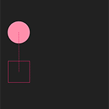</td>
      <td><pre><code class="language-swift">ArcMove</code></pre></td>
      <td><pre><code class="language-swift">let arcMove = ArcMove()
arcMove.from.value = <#from#>
arcMove.to.value = <#to#>
runtime.add(arcMove, to: <#view#>)</code></pre></td>
    </tr>
    <tr>
      <td align="center">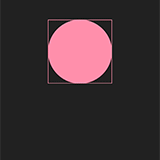</td>
      <td><pre><code class="language-swift">ChangeDirection</code></pre></td>
      <td><pre><code class="language-swift">runtime.add(ChangeDirection(withVelocityOf: gesture),
            to: <#view#>)</code></pre></td>
    </tr>
    <tr>
      <td align="center">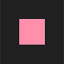</td>
      <td><pre><code class="language-swift">DirectlyManipulable</code></pre></td>
      <td><pre><code class="language-swift">runtime.add(DirectlyManipulable(), to: <#view#>)</code></pre></td>
    </tr>
    <tr>
      <td align="center">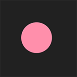</td>
      <td><pre><code class="language-swift">Draggable</code></pre></td>
      <td><pre><code class="language-swift">runtime.add(Draggable(), to: <#view#>)</code></pre></td>
    </tr>
    <tr>
      <td align="center">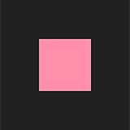</td>
      <td><pre><code class="language-swift">Rotatable</code></pre></td>
      <td><pre><code class="language-swift">runtime.add(Rotatable(), to: <#view#>)</code></pre></td>
    </tr>
    <tr>
      <td align="center">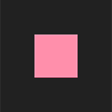</td>
      <td><pre><code class="language-swift">Scalable</code></pre></td>
      <td><pre><code class="language-swift">runtime.add(Scalable(), to: <#view#>)</code></pre></td>
    </tr>
    <tr>
      <td align="center">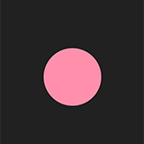</td>
      <td><pre><code class="language-swift">SetPositionOnTap</code></pre></td>
      <td><pre><code class="language-swift">runtime.add(SetPositionOnTap(),
            to: runtime.get(<#view#>.layer).position)</code></pre></td>
    </tr>
    <tr>
      <td align="center">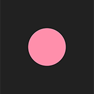</td>
      <td><pre><code class="language-swift">Spring</code></pre></td>
      <td><pre><code class="language-swift">let spring = Spring()
spring.destination.value = <#initial destination#>
runtime.add(spring, to: <#view#>)</code></pre></td>
    </tr>
    <tr>
      <td align="center">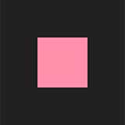</td>
      <td><pre><code class="language-swift">Tossable</code></pre></td>
      <td><pre><code class="language-swift">let tossable = Tossable()
tossable.spring.destination.value = <#initial destination#>
runtime.add(tossable, to: <#view#>)</code></pre></td>
    </tr>
    <tr>
      <td align="center">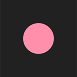</td>
      <td><pre><code class="language-swift">Tween</code></pre></td>
      <td><pre><code class="language-swift">runtime.add(Tween(duration: 0.5, values: [1, 0]),
            to: runtime.get(<#view#>.layer).opacity)</code></pre></td>
    </tr>
  </tbody>
</table>

## Installation

### Installation with CocoaPods

> CocoaPods is a dependency manager for Objective-C and Swift libraries. CocoaPods automates the
> process of using third-party libraries in your projects. See
> [the Getting Started guide](https://guides.cocoapods.org/using/getting-started.html) for more
> information. You can install it with the following command:
>
>     gem install cocoapods

Add `MaterialMotion` to your `Podfile`:

```ruby
pod 'MaterialMotion'
```

You will need to add `use_frameworks!` to your Podfile in order use Material Motion in your swift
app.

A simple Podfile might look like so:

```ruby
project 'MyApp/MyApp.xcodeproj'

use_frameworks!

target 'MyApp' do
  pod 'MaterialMotion'
end
```

Then run the following command:

```bash
pod install
```

### Usage

Import the framework:

```swift
import MaterialMotion
```

You will now have access to all of the APIs.

## Example apps/unit tests

Check out a local copy of the repo to access the Catalog application by running the following
commands:

```bash
git clone https://github.com/material-motion/material-motion-swift.git
cd material-motion-swift
pod install
open MaterialMotion.xcworkspace
```

## Case studies

### Carousel

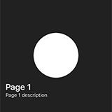

A carousel with pages that scale in and fade out in reaction to their scroll position.

[View the source](examples/CarouselExample.swift).

### Contextual transition

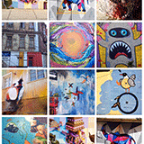

A contextual view can be used to create continuity during transitions between view controllers. In
this case study the selected photo is the contextual view. It's  possible to flick the view to
dismiss it using the tossable interaction.

Makes use of: `Draggable`, `Tossable`, `Transition`, `TransitionSpring`, `Tween`.

[View the source](examples/ContextualTransitionExample.swift).

### Floating action button transition

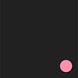

A floating action button transition is a type of contextual transition that animates a mask outward
from a floating button.

Makes use of: `Transition` and `Tween`.

[View the source](examples/FabTransitionExample.swift).

### Material expansion


A Material Design transition using assymetric transformations.

Makes use of: `Tween`.

[View the source](examples/MaterialExpansionExample.swift).

### Modal dialog


A modal dialog that's presented over the existing context and is dismissable using gestures.

Makes use of: `Tossable` and `TransitionSpring`.

[View the source](examples/ModalDialogExample.swift).

### Pull down to dismiss


A modal scroll view controller that can be dismissed with a drag gesture.

Makes use of: `Tossable` and `TransitionSpring`.

[View the source](examples/InteractivePushBackTransitionExample.swift).

### Sticker picker

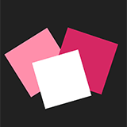

Each sticker is individually **directly manipulable**, meaning they can be dragged, rotated, and
scaled using multitouch gestures.

Makes use of: `DirectlyManipulable`.

[View the source](examples/StickerPickerExample.swift).

## Contributing

We welcome contributions!

Check out our [upcoming milestones](https://github.com/material-motion/material-motion-swift/milestones).

Learn more about [our team](https://material-motion.github.io/material-motion/team/),
[our community](https://material-motion.github.io/material-motion/team/community/), and
our [contributor essentials](https://material-motion.github.io/material-motion/team/essentials/).

## License

Licensed under the Apache 2.0 license. See LICENSE for details.
